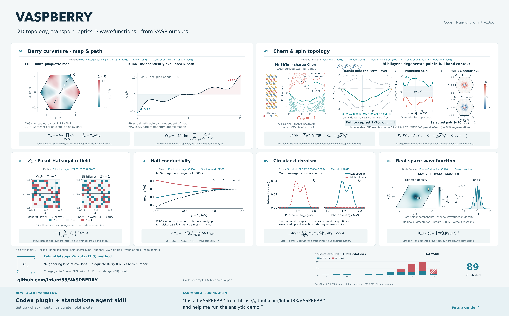

# VASPBERRY

**Topology and response functions directly from VASP wavefunctions.**
VASPBERRY reads `WAVECAR` for wavefunction overlaps and uses same-run
`WAVEDER` optical matrix elements for standard charge Kubo calculations. Use the Fukui–Hatsugai–Suzuki (FHS) link-variable
method, also called the Fukui method, for Chern numbers. The separate
Fukui–Hatsugai (FH) n-field method gives the 2D Z₂ invariant. Kubo-formula
calculations provide Berry-curvature maps, symmetry-path curves and intrinsic
charge Hall response. Projected-spin Chern
numbers and spin-sector Kubo-formula Berry curvature use a matching `OUTCAR`
to establish the Cartesian spin frame.

```text
VASP calculation → WAVECAR (+ WAVEDER for charge Kubo)
                 → VASPBERRY → numerical output → analysis / plots
```

VASP supplies the material's electronic structure. VASPBERRY postprocesses it;
band plots provide context for the calculated topology and response.

[Technical report](docs/TECHNICAL_REPORT.md) ([PDF](docs/TECHNICAL_REPORT.pdf)) ·
[Feature poster (PDF)](docs/VASPBERRY_FEATURE_POSTER.pdf) ([figure notes](docs/VASPBERRY_FEATURE_POSTER.md)) ·
[Hands-on commands](docs/HANDS_ON.md) · [Feature examples](examples/README.md) · [Build guide](docs/BUILD.md) ·
[Postprocessing guide](docs/POSTPROCESSING.md) · [Output formats](docs/OUTPUT_FORMAT.md)

[](docs/VASPBERRY_FEATURE_POSTER.pdf)

Click the poster to open the full-resolution PDF and its linked references.
See the [figure notes](docs/VASPBERRY_FEATURE_POSTER.md) for calculation scope and approximations.

**VASPBERRY 1.6.6 — WAVEDER is the standard Kubo input.**
`--task kubo` uses same-run `WAVEDER`, `WAVECAR`, `INCAR` and `OUTCAR` by
default. Select a single band, a range or a list for geometric curvature, or
use occupation-weighted Python integration for a selected contribution. The
required matrix pairs and producer-degenerate groups are checked for every
request. Missing or unsupported optical input stops the calculation.
The previous canonical-momentum approximation requires the explicit
`--kubo-source wavecar` option and prints a warning. See the
[standard calculation protocol](docs/WAVEDER_KUBO_PROTOCOL.md) and
[migration guide](docs/MIGRATION.md#waveder-default-kubo-input-in-165).

Version 1.6.6 aligns command validation and examples and records the
[numerical report reproduction](docs/TECHNICAL_REPORT.md#appendix-c-numerical-reproduction-check-of-2026-10-04).

The native `--bundle` and `-kubo_bundle` flags have been removed. See the
[short migration guide](docs/MIGRATION.md#native-kubo-band-selection),
[release notes](docs/releases/v1.6.6.md), [validation scope](docs/VALIDATION_1.6.6.md),
[changelog](CHANGELOG.md) and [version policy](docs/RELEASING.md).

## Install and run VASPBERRY

The VASPBERRY executable requires a **Fortran compiler, GNU Make, POSIX shell/tools
and LP64 BLAS/LAPACK libraries**. An MPI build additionally needs the matching
MPI **development package/compiler wrapper and runtime launcher**. These
native dependencies are sufficient to compile and run VASPBERRY on an existing
compatible `WAVECAR`. Python is used by the optional numerical postprocessing
and plotting tools.

| Environment | Required native development environment | Build and executable |
|---|---|---|
| Linux, Intel serial | Intel oneAPI `ifx` + oneMKL | `make ifx` → `build/vaspberry-ifx` |
| Linux, Intel MPI (main walkthrough) | `ifx` + Intel MPI SDK (`mpiifx`) + oneMKL | `make ifx-mpi` → `build/vaspberry-ifx-mpi` |
| Linux, GNU serial | GNU Fortran + LP64 BLAS/LAPACK | `make serial` → `build/vaspberry` |
| Linux, GNU MPI | GNU Fortran + Open MPI or MPICH development libraries + LP64 BLAS/LAPACK | `make mpi` → `build/vaspberry-mpi` |
| macOS, GNU | Compatible GNU Fortran/MPI libraries and LP64 BLAS/LAPACK | See the architecture-specific [build guide](docs/BUILD.md) for paths and available packages |

Retained Intel Classic installations use `make ifort` or `make ifort-mpi`.
On Windows use a Linux environment such as WSL2 and its Linux compiler stack;
there is no native Windows build. The [build guide](docs/BUILD.md) distinguishes
CI-validated environments from installation guidance and covers cluster modules,
macOS, MPICH, runtime libraries and common errors.

### Get the source

Clone the repository's default branch (`master`):

```bash
git clone https://github.com/Infant83/VASPBERRY.git
cd VASPBERRY
make help
```

For the fixed source corresponding to this guide, use
[v1.6.6](https://github.com/Infant83/VASPBERRY/releases/tag/v1.6.6):

```bash
git clone --branch v1.6.6 --depth 1 https://github.com/Infant83/VASPBERRY.git VASPBERRY-1.6.6
cd VASPBERRY-1.6.6
make serial
```

Release notes record its verified commit and checks. Earlier archives,
including v1.6.3, retain their own documentation and do not provide these
WAVEDER-default commands. The prepared 1.6.4 candidate was not published;
1.6.5 supersedes it.
Run build commands from the directory containing `Makefile`.
**Archive builds do not require Git or Python.** No precompiled executable or
system-wide installation is needed; the build creates local files in `build/`.
Update an existing default-branch checkout with `git pull --ff-only`, then
rebuild. Release tags stay fixed. Large example inputs may separately need
the [input-fetch procedure](examples/INPUTS.md).

### Intel oneAPI and Intel MPI on Linux

Install/load the Fortran compiler, Intel MPI SDK and oneMKL development
components; having only runtime libraries is insufficient. In Bash, activate
the installed environment or use the site's equivalent modules:

```bash
source /opt/intel/oneapi/setvars.sh
make ifx-mpi
make check-ifx-mpi
mpiexec -n 4 ./build/vaspberry-ifx-mpi --help
```

Replace the setup path with the site's actual oneAPI installation. Use the
`mpiexec` from the same Intel MPI environment as `mpiifx`, and run within an
allocation that permits the requested rank count. `check-ifx-mpi` builds and
checks two-rank startup/communication/help. Intel Classic uses
`make check-ifort-mpi`. For a machine without MPI, use `make ifx`,
`make check-ifx`, and run `./build/vaspberry-ifx --help` directly.

### GNU on Ubuntu/Debian

The serial executable needs no MPI package:

```bash
sudo apt-get update
sudo apt-get install make gfortran libblas-dev liblapack-dev
make serial
make check-serial-help
./build/vaspberry --help
```

For Open MPI, add the development/runtime packages and build the MPI version:

```bash
sudo apt-get install openmpi-bin libopenmpi-dev
make mpi
make check-gnu
mpiexec -n 4 ./build/vaspberry-mpi --help
```

On a cluster, use its installed modules/libraries instead of these administrator
commands. Compiler, wrapper and library paths can be supplied to Make; see
[build overrides and platform recipes](docs/BUILD.md). The supplied builds
use byte-based WAVECAR records and **LP64**, not ILP64, numerical libraries.
Serial executables run directly; MPI executables run with their matching
launcher. Keep the compiler/MPI/library environment loaded when running.

Use your usual Python environment for the optional `tools/` commands. Their
full dependency versions are in [requirements-transport.txt](requirements-transport.txt);
Matplotlib is used by the supplied postprocessing and plotting tools.
Environment creation and package installation follow your site's usual practice.

## Features

| Task | Command / route | Examples and results |
|---|---|---|
| Berry flux and Chern number of an isolated band or bundle using the Fukui method | `--task chern` | [MoS₂ BZ map](examples/features/fukui-berry-curvature/), [Bi occupied bundle](examples/features/fukui-chern/) |
| Projected-spin sector Chern numbers | `--task spin-chern` | [Graphene with intrinsic SOC](examples/materials/graphene-spin-chern/); `SPIN_CHERN.csv`, plaquette flux and spin spectra |
| Spin-sector Kubo-formula Berry curvature | `--task spin-kubo` | [Path and mesh guide](docs/SPIN_KUBO.md); native sector curvature CSVs and explicitly approximate mesh integrals |
| 2D Z₂ invariant and n-field using the FH method | `--task z2` | [MoS₂ (Z₂ = 0) and Bi (Z₂ = 1)](examples/features/z2/comparison/) |
| Kubo-formula Berry curvature on a BZ mesh or symmetry path | `--task kubo` | [MoS₂ occupied bundle and isolated-band maps, paths and bands](examples/features/kubo-curvature/) |
| Intrinsic charge Hall response versus chemical potential and temperature | Python `kubo-hall` with standard WAVEDER input; select `--bands` for a contribution or `--occupied` for insulating T=0 | [Standard protocol](docs/WAVEDER_KUBO_PROTOCOL.md), [selected-band commands](examples/features/waveder-selected/); [MoS₂ curves](examples/features/kubo-hall/) retain the explicit WAVECAR approximation |
| Circular optical selectivity and transition spectra | `--task optical` / `--task spectrum` | [MoS₂ circular dichroism](examples/features/circular-dichroism/) |
| Real-space wavefunction at Γ | `--task wavefunction` | [MoS₂ wavefunction](examples/features/wavefunction/) |

Plaquette flux from the Fukui method and Kubo-formula point Berry curvature
are different finite-grid quantities. A Chern number computed with the Fukui method needs band
isolation and mesh checks. A Kubo-formula curvature integral is not rounded to
an integer; its k mesh and intermediate band window must be converged. The standard charge
Kubo route uses PAW longitudinal optical connections stored by VASP in WAVEDER.
Explicit `--kubo-source wavecar` uses canonical momentum of pseudo-wavefunctions
and omits those augmentation/nonlocal terms. Selected WAVEDER bands retain
the full source intermediate-band sum; metallic or finite-temperature scans
require every nonzero-weight pair. Missing pairs, unresolved weighted groups
or unsupported spin-current requests do not trigger an automatic fallback; see
[operator choices](docs/OPERATOR_ROUTES.md).
For spin-sector convergence, use [`--sum-bands N`](docs/SPIN_KUBO.md#real-examples-and-interpretation)
to vary the intermediate sum on unchanged wavefunctions. The
[Bi comparisons](examples/materials/bi-spin-hall/spin-chern-kubo/convergence/)
separate this from mesh and source-state changes; the
[graphene controls](examples/materials/graphene-spin-chern/kubo/convergence/)
resolve a local SOC peak without claiming a converged full-BZ Kubo-formula curvature integral.

For **layer, atom, orbital and spin character**, combine a matching SOC
`PROCAR` with the WAVECAR and actual spin frame from `OUTCAR` using
the optional `[projection]` and `[group NAME]` sections in the
[postprocessing settings](docs/POSTPROCESSING.md). Named atom/orbital groups and a Cartesian spin
axis define the projections. The same saved native pair data support
chemical-potential/temperature scans of selected-band projected charge-Hall
contributions. Follow the [projection tutorial](examples/features/procar-character/)
for commands and an explicitly synthetic reproducibility fixture. These
projections explain state character; conventional spin-current Hall uses the
separate operator route described in the [spin guide](docs/SPIN_HALL.md).

## Usage

### Find a calculation with native help

VASPBERRY provides a short overview and help for individual tasks
and options. After building, list the tasks, inspect a calculation, then run
the first example below:

```bash
mpiexec -n 4 ./build/vaspberry-ifx-mpi --help
mpiexec -n 4 ./build/vaspberry-ifx-mpi --help task
mpiexec -n 4 ./build/vaspberry-ifx-mpi --help kubo
mpiexec -n 4 ./build/vaspberry-ifx-mpi --help bands
```

Help runs in the native Fortran executable; it needs neither Python nor a
WAVECAR. Use `--help spin-chern` for that task, `--help options` to find option
names, and `--help all` (also `--help legacy`) for the complete flag reference.
`-h` is the short form of `--help`. See the
[native help guide](docs/NATIVE_COMMANDS.md#learn-one-task-or-option-at-a-time).

Task help groups a copyable command, required inputs, output data and units,
common options, and validity conditions. Option help shows defaults and the
tasks to which it applies. The same plain text works in a terminal, redirected
to a file, or read by an agent.

### Standard Kubo calculation: same-run optical files

Follow the [standard protocol](docs/WAVEDER_KUBO_PROTOCOL.md) to generate
`WAVEDER`, `WAVECAR`, `INCAR` and `OUTCAR` with standard VASP 5.4.4
longitudinal optical branch. For a run with an insulating occupied space (inferred from the source):

```bash
mkdir -p results/paw-kubo
build/vaspberry --task kubo --input-dir path/to/optics \
  --curvature-csv results/paw-kubo/KUBO.csv
```

`--input-dir` selects the source directory; if omitted, it is the directory
from which the command is launched. Standard Kubo reads `WAVECAR`,
`WAVEDER`, `INCAR` and `OUTCAR` there. Per-file options `--wavecar`,
`--waveder`, `--incar` and `--outcar` override only their named file; a
WAVECAR override never redirects the other files. Relative CLI paths and
output paths are resolved from the launch directory, not from `--input-dir`.
The exact occupied count and
producer must pass validation. No VASP source patch or square matrix
padding is needed. The [actual MnBi₂Te₄ example](examples/materials/mnbi2te4-qah/)
provides an input recipe and a deliberately unconverged coarse-mesh reference.
For a geometric selection, add `--bands 31,33:34`; add `--per-band 1` only
when separate resolvable bands are needed. This selection changes the target
bands, not the full source virtual-band sum. Its mesh integral is a geometric
contribution, not automatically the total physical AHC. The
[selected-band example](examples/features/waveder-selected/) shows both native
curvature and occupation-weighted Python commands.

### WAVECAR approximation example: the supplied MoS₂ file

Run from the repository root. This small example uses the actual SOC
band-path WAVECAR already in the repository. Its explicit source selection
reproduces the canonical-momentum approximation and writes the curvature of
the occupied bands 1–18 at its supplied k points:

```bash
mkdir -p results/mos2-path
mpiexec -n 4 ./build/vaspberry-ifx-mpi --task kubo --kubo-source wavecar \
  --wavecar examples/1H-MoS2/KPATH/2.band/WAVECAR --bands 1:18 \
  --curvature-csv results/mos2-path/KUBO.csv
```

`KUBO.csv` contains one row per k point/spin channel, with fractional
k coordinates, `omega_z_A2` (Ωxy in Ų) and `min_external_gap_eV`.
VASPBERRY has already evaluated the occupied-bundle sum: plot `omega_z_A2`
against the ordered `k_index` for this path. For a mesh map, convert the
fractional coordinates with the reciprocal lattice. The
[MoS₂ tutorial](examples/features/kubo-curvature/) separately provides a
matching full-BZ/path dataset and commands for the reference panels. A line
path alone cannot supply a BZ integral. Use a fresh output
path for each run.

A multi-band trace defaults to `KUBO.csv` if `--curvature-csv` is omitted.
For separate bands, use `--bands 18:19 --per-band 1`; each selected band must
be separated from every other stored band by more than 1e-5 eV. The trace
requires this gap only between the selected subspace and excluded bands.

### Apply the same commands to your system

Choose the mesh and band range from your VASP calculation. VASPBERRY detects
one- or two-component wavefunctions from WAVECAR automatically; an optional
`--spinor 1` or `--spinor 2` checks that the file matches your expectation.
These illustrative commands assume the appropriate source files in the working
directory; the band indices are examples, not universal occupied counts.
Commands that select `--kubo-source wavecar` deliberately reproduce the
previous approximation. They do not acquire PAW terms from a nearby WAVEDER.

```bash
# Berry flux and Chern number from the Fukui method: full 12 × 12 mesh, bands 1–18.
mpiexec -n 4 ./build/vaspberry-ifx-mpi --task chern --wavecar WAVECAR \
  --mesh 12,12 --bands 1:18 --output BERRYCURV

# Bi example: full even mesh, occupied spinor bands 1–10.
mpiexec -n 4 ./build/vaspberry-ifx-mpi --task z2 --wavecar WAVECAR \
  --mesh 12,12 --bands 1:10 --output NFIELD

# Occupied-bundle point curvature, excluding internal transitions.
mpiexec -n 4 ./build/vaspberry-ifx-mpi --task kubo --kubo-source wavecar --wavecar WAVECAR \
  --bands 1:18 --curvature-csv KUBO_BUNDLE.csv

# Reusable all-band pair numerators for charge Hall postprocessing.
mpiexec -n 4 ./build/vaspberry-ifx-mpi --task kubo-pairs --kubo-source wavecar --wavecar WAVECAR \
  --pairs-csv PAIRS.csv
```

The native syntax groups a mesh as `NX,NY` and a band range as `FIRST:LAST`.
Specialized legacy options can still be used. A named Kubo task uses the
new band-range semantics even when its endpoints are given by `-ii`/`-if`.
Pure legacy `-kubo` commands retain separate-band output with the same
isolation checks. `--task kubo-integral` additionally evaluates the mesh integral.
Use `mpiexec -n 4 ./build/vaspberry-ifx-mpi --help all` or the [native command reference](docs/NATIVE_COMMANDS.md) for the full list. For example:

```bash
mpiexec -n 4 ./build/vaspberry-ifx-mpi --task chern --wavecar WAVECAR \
  --mesh 12,12 --bands 1:18 --output BERRYCURV
```

For Z₂, use a nonmagnetic time-reversal-symmetric insulator and a full,
unshifted, even `Nx × Ny × 1` mesh with `Nx,Ny >= 4`, generated with
`ISYM=-1`. Report only a final `Z2_FIELD.csv` with `result_status=PASS`,
`reportable_invariant=1` and matching half-zone parities. See the
[Z₂ guide](docs/Z2_FUKUI_HATSUGAI.md) for input and convergence checks.

### Postprocess and plot saved results

For the standard WAVEDER route, use `kubo-hall` or the INI example in the
[protocol](docs/WAVEDER_KUBO_PROTOCOL.md). The following
[public Bi walkthrough](examples/features/simple-postprocess/) demonstrates
the explicit WAVECAR approximation; its INI sets `kubo_source = wavecar`.
Its [`bi.ini`](examples/features/simple-postprocess/bi.ini) needs only `[run]`
(input, native executable, mesh and output) and `[hall]` (μ, reference and
temperature). After its build/input step, run from the repository root:

```bash
python3 tools/vaspberry_post.py run examples/features/simple-postprocess/bi.ini
python3 tools/vaspberry_post.py plot results/simple-bi
```

The first command executes **VASPBERRY** with the configured MPI launcher
and rank count, then uses Python for numerical Hall integration. The second
command draws the completed table. You edit one INI file, and the tool records the underlying
commands. The files remain usable in Python, Origin, gnuplot or other software:

| Stage | File under `results/simple-bi/` | Contents and use |
|---|---|---|
| VASPBERRY execution: `WAVECAR` → pair data | `native/PAIRS.csv` | Energies, k coordinates and three interband pair numerators in eV² Ų; reusable matrix data before occupations and Hall integration. |
| Numerical postprocessing | `hall/conductivity.csv` and `.dat` | Sheet σ and reference-subtracted Δσ in e²/h, as functions of μ, temperature and region, plus represented carrier counts. |
| Plotting | `figures/charge-hall/hall.png`, `.pdf`, `.svg` | Total charge-Hall conductivity versus μ−reference. |

Use the [beginner guide](docs/POSTPROCESSING.md) to add one feature at a time:
change the μ/T scan, reuse saved pairs, select a k-space region, then add
PROCAR groups when needed. The [Bi rescan and region examples](examples/features/simple-postprocess/)
are runnable extensions of the first calculation. The
[PROCAR tutorial](examples/features/procar-character/) explains the matching
extra inputs and has a separate analytic fixture; it is not part of the Bi input.
Consult the [settings reference](docs/POSTPROCESSING_REFERENCE.md) for all keys
and defaults, or the [output specification](docs/OUTPUT_FORMAT.md) for columns
and units.

For a curvature map or symmetry-path curve, native `--task kubo` already
writes gap-divided `omega_z_A2` in `KUBO.csv`; that result can be plotted
directly in your preferred plotting tool. The direct VASPBERRY commands above
require no Python script; the INI `run` command additionally automates cache
validation and numerical Hall integration. See the [MoS₂ curvature example](examples/features/kubo-curvature/).
The [hands-on commands](docs/HANDS_ON.md) and
[individual Kubo-formula transport stages](docs/KUBO_TRANSPORT.md#native-pairs-to-charge-hall)
remain available for users who need direct control of each stage.

## Optional extensions and supporting checks

The main tutorials above use ordinary VASP wavefunctions. Separate guides
cover extra operators and independent checks:

- [PAW optical and full-velocity comparisons](docs/OPERATOR_ROUTES.md),
  including [matched MoS₂ charge Hall data](examples/features/kubo-hall/operator-comparison/).
- [Conventional spin Hall response](docs/SPIN_HALL.md) with explicitly
  supplied spin and velocity matrices; [Bi results](examples/materials/bi-spin-hall/)
  complement its directly calculated Z₂ invariant.
- [Advanced geometric transport](docs/VALLEY_TRANSPORT.md),
  [matrix interfaces](docs/KUBO_TRANSPORT.md#applying-the-workflow-to-other-data)
  and [developer model checks](validation/models/).

The [technical report](docs/TECHNICAL_REPORT.md) connects these capabilities
to reference figures. The [material catalog](examples/materials/) records
input preparation and sampling. The Chern-number calculation follows
[Fukui, Hatsugai and Suzuki, JPSJ 74, 1674 (2005)](https://doi.org/10.1143/JPSJ.74.1674).
The separate Z₂ n-field calculation follows
[Fukui and Hatsugai, JPSJ 76, 053702 (2007)](https://doi.org/10.1143/JPSJ.76.053702).
Method-specific references are given in each guide.

## Contributors

* Hyun-Jung Kim: Main developer and maintainer; responsible for subsequent
  development and ongoing updates of the Kubo implementation.
* Sun-Woo Kim: Contributions to circular dichroism and the initial Kubo
  implementation.

## Citation

```bibtex
@software{Kim_VASPBERRY_2018,author = {Kim, Hyun-Jung},doi = {10.5281/zenodo.1402593},month = {8},title = {{VASPBERRY}},url = {https://github.com/Infant83/VASPBERRY},version = {1.0},year = {2018}}

@article{PhysRevLett.128.046401,
  title = {Circular Dichroism of Emergent Chiral Stacking Orders in Quasi-One-Dimensional Charge Density Waves},
  author = {Kim, Sun-Woo and Kim, Hyun-Jung and Cheon, Sangmo and Kim, Tae-Hwan},
  journal = {Phys. Rev. Lett.},
  volume = {128},
  issue = {4},
  pages = {046401},
  numpages = {6},
  year = {2022},
  month = {Jan},
  publisher = {American Physical Society},
  doi = {10.1103/PhysRevLett.128.046401},
  url = {https://link.aps.org/doi/10.1103/PhysRevLett.128.046401}
}
```
