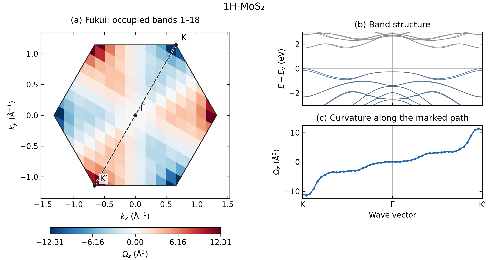

# Berry curvature and response functions from VASP wavefunctions

[Download the PDF report](TECHNICAL_REPORT.pdf).

## Abstract

VASPBERRY evaluates geometric and response properties from VASP electronic
states. This report illustrates the discrete-wavefunction and Kubo approaches
with monolayer MoS₂ and a Bi bilayer. The examples cover reciprocal-space Berry
curvature, Chern and Z₂ indices, intrinsic charge Hall response, circular
optical transitions and real-space spinor densities. Berry-curvature maps use
Cartesian coordinates, band paths use distances along named high-symmetry
directions, and the Z₂ n-field is shown in reduced coordinates to display its
half-zone sums. The calculation guides provide the VASP files and executable commands.

## 1. Methods

### 1.1 Berry curvature from wavefunction overlaps

The Fukui–Hatsugai–Suzuki method evaluates the Berry phase around each cell
of a periodic k mesh using overlaps between neighboring wavefunctions.
For an isolated group of bands, the overlap is a matrix and its determinant
gives a gauge-invariant loop phase. With the connection
$\mathbf A=i\langle u|\nabla_\mathbf{k}u\rangle$ used here,

$$
\Phi_p=-\arg\!\left(U_1(\mathbf k)
U_2(\mathbf k+\Delta\mathbf k_1)
U_1(\mathbf k+\Delta\mathbf k_2)^{-1}
U_2(\mathbf k)^{-1}\right),\qquad
\overline\Omega_p=\frac{\Phi_p}{\Delta S_k}.
$$

The normalized link $U_j$ is the phase of the overlap determinant.
$\Delta S_k=|\mathbf b_1\times\mathbf b_2|/(N_1N_2)$ is the area of a mesh
cell, with reciprocal vectors containing $2\pi$. Thus $\Phi_p$ is a phase
and $\overline\Omega_p$ is an area-averaged curvature in Ų. The Chern number
is $C=(2\pi)^{-1}\sum_p\Phi_p$. An isolated occupied group can include internal
degeneracies; its separation from excluded bands remains essential.
The discrete construction and its band-group extension are described by
[Fukui, Hatsugai and Suzuki](https://doi.org/10.1143/JPSJ.74.1674).

The map and integral convey different information. A material can have strong
local curvature at opposite valleys while its total Chern number is zero.
An integer lattice Chern result also needs a sufficiently resolved mesh and
a physically appropriate isolated band group.

### 1.2 Kubo curvature and Hall conductivity

For an isolated band and a Cartesian Hamiltonian derivative
$D_\alpha=\partial H/\partial k_\alpha$,

$$
\Omega_{n,xy}(\mathbf k)=-2\,\mathrm{Im}
\sum_{m\ne n}\frac{D_{x,nm}D_{y,mn}}{(E_n-E_m)^2}.
$$

This form resolves curvature at each sampled k point. Sharp curvature near
small gaps makes the k sampling and intermediate-band window particularly
important. Individual-band values are not used where the sampled bands
cannot be resolved separately. The native WAVECAR implementation uses
canonical momentum of the stored pseudo-wavefunctions; full material velocity
can require PAW, nonlocal and SOC terms. The exported-matrix interface permits
an explicitly supplied physical operator.

For a two-dimensional system, the intrinsic charge sheet conductivity is

$$
\sigma_{xy}(\mu,T)=-\frac{e^2}{\hbar}
\sum_n\int_\mathrm{BZ}\frac{d^2k}{(2\pi)^2}\,
 f(E_{n\mathbf k}-\mu,T)\Omega_{n,xy}(\mathbf k).
$$

Within an insulating gap at zero temperature, this becomes
$\sigma_{xy}=-(e^2/h)C_\mathrm{occ}$ in the stated convention. General
background on Berry curvature and electronic transport is given in
[Xiao, Chang and Niu](https://doi.org/10.1103/RevModPhys.82.1959).
The [Bi Hall example](../examples/features/hall-valley/) evaluates the occupied-group flux directly;
it does not assign independent curvatures to unresolved Kramers partners.

## 2. Materials and numerical settings

| Dataset | Wavefunctions and sampling | Quantities shown |
|---|---|---|
| Monolayer MoS₂, full zone | SOC; 12×12 mesh; 26 bands; 400 eV | Fukui occupied-group and Kubo band-18 curvature maps |
| Monolayer MoS₂, matching path | SOC; 49 K–Γ–K′ points; 26 bands; 400 eV | Band structure and Kubo curvature beside the maps |
| Monolayer MoS₂, supplied path | SOC; 48 K–Γ–K′ points; 32 bands; 400 eV | Optical spectra and Γ-point state density |
| Buckled Bi bilayer | SOC; full 12×12 mesh; 18 bands; occupied bands 1–10 | Fukui–Hatsugai n-field and Z₂ invariant |

The [input guide](../examples/INPUTS.md) links the structures and VASP files.
The MoS₂ maps and their matching path use the same public SCF charge density,
structure, potentials, cutoff and 26-band window. VASP 5.4.4 generated the
12×12 mesh and 49-point path with `ICHARG=11` and `ISYM=-1`; only the k-point
list changes. The sampled occupied-to-empty direct gap is 1.674 eV. The
tutorial supplies preparation files and commands for both WAVECARs.
The optical and real-space examples retain the separate supplied 32-band path.

## 3. Results

### 3.1 MoS₂: Fukui Berry curvature over the full Brillouin zone

**Figure 1.** (a) Fukui Berry curvature of occupied bands 1–18 in the
Cartesian first Brillouin zone. The dashed line marks K–Γ–K′, with
K = (1/3, 2/3) and K′ = −K in reciprocal coordinates. Native 12×12 plaquette
values are shown without smoothing. (b) Band structure along that path;
energies are relative to the valence-band maximum, with occupied bands in
blue and empty bands in gray. (c) A periodic bilinear cut of the plaquette
field along the marked path. This line visualizes panel (a), rather than
adding an independent pointwise curvature calculation. Both right-hand
panels share the same Cartesian path distance.

The curvature has opposite signs near the time-reversed K and K′ valleys.
The largest sampled magnitudes are approximately **12.31 Ų**, while the
full-zone Chern number is zero to numerical precision. The native text map
integrates to approximately −5 × 10⁻⁷ after decimal rounding. This illustrates the distinction between
valley-contrasting local geometry and vanishing total charge Chern number.
The connection between inversion breaking, spin–orbit coupling and valley
optical response in MoS₂ is discussed by
[Xiao et al.](https://doi.org/10.1103/PhysRevLett.108.196802).
The present map is a finite-mesh example rather than a convergence study.

[Calculation and plotting commands](../examples/features/fukui-berry-curvature/)

### 3.2 MoS₂: Kubo curvature in the Brillouin zone and along K–Γ–K′

**Figure 2.** (a) Canonical-momentum Kubo curvature of band 18 on the
12×12 mesh, using intermediate bands 1–26. Each colored cell represents one
k-point sample. The dashed K–Γ–K′ path is the same as in Figure 1.
(b) Band structure along the path, with band 18 highlighted in orange.
(c) Kubo curvature calculated directly at the 49 path points, using the
same intermediate-band window. Gray map cells and gaps in the curve mark
states with a nearest-band separation of at most $10^{-5}$ eV. These
unresolved individual-band values are omitted from both panels.

Band 18 has opposite valley curvatures, approximately **−6.41 Ų at K** and
**+6.41 Ų at K′** for this 26-band window. The map and path use matching
electronic-structure settings, and the band panel locates the selected state
relative to the gap. The 12×12 sampling and intermediate-state sum still
require convergence for quantitative material predictions.

Figure 1 shows the complete occupied-group plaquette curvature; Figure 2
shows pointwise curvature of a single band in the canonical-momentum
approximation. Their amplitudes therefore represent different quantities.
Neither a line cut nor an individual-band map with unresolved states supplies
the complete occupied-space integral for a Chern number or Hall conductivity.

[Calculation and interpretation](../examples/features/kubo-curvature/)

### 3.3 MoS₂: valley-selective circular transitions

**Figure 3.** Left- and right-circular spectra at K and K′ and the selectivity
$\eta=(I_L-I_R)/(I_L+I_R)$ along the path. Normal incidence is used, with
0.05 eV Gaussian broadening and transitions from occupied bands 1–18 to
bands 19–20. White regions in the selectivity map exclude negligible intensity.

The first peak occurs near **1.67 eV**. Its selectivity is −1 at K and +1
at K′ in VASPBERRY's channel convention. The opposite helicities provide a
clear illustration of valley-selective transitions. Intensities are in
arbitrary units and retain the native sampling normalization; an absolute
absorption spectrum requires a full-zone calculation and the appropriate
optical matrix elements.

[Optical calculation guide](../examples/features/circular-dichroism/)

### 3.4 Bi: Fukui–Hatsugai Z₂ invariant and n-field map

For the Bi bilayer, VASPBERRY evaluates the
[Fukui–Hatsugai lattice n-field](https://doi.org/10.1143/JPSJ.76.053702)
from the occupied SOC bands 1–10 on a full Γ-centered 12×12 mesh.
With the time-reversal-compatible gauge used in this construction, the
Z₂ invariant is the parity of the integer-field sum over a half Brillouin zone:

$$
\nu=\left[\sum_{p\in B_{1/2}} n(p)\right]\bmod 2.
$$

**Figure 4.** Fukui–Hatsugai integer field $n(\mathbf k)$ calculated from the
Bi VASP spinor wavefunctions. Red, white and blue denote +1, 0 and −1,
respectively. The native plaquettes are displayed without interpolation in
dimensionless reduced coordinates, $\mathbf k=q_1\mathbf b_1+q_2\mathbf b_2$,
with opposite edges periodically identified. The line at $q_2=0$ separates
the upper and lower half zones. The occupied-band calculation gives **Z₂ = 1**.

The upper and lower half-zone sums are **−3 and +3**, respectively. Both are odd,
so their parities agree at **$\nu=1$**, identifying the nontrivial
time-reversal-symmetric insulating phase for this calculation.
The sampled minimum direct and global gaps are **0.592 eV** and **0.510 eV**.

The local n-field depends on the gauge and logarithm branch; its half-zone
parity is the invariant. The reduced-coordinate map shows the original mesh
half-zones used for these sums. The separate occupied **C = 0** and zero charge-Hall
response are consistent with this nontrivial Z₂ result.

[Z₂ calculation and plotting guide](../examples/features/z2/) ·
[Numerical n-field data](../examples/features/z2/reference/Z2_FIELD.csv)

### 3.5 MoS₂: a real-space Γ state

**Figure 5.** Projected pseudo-wavefunction density of band 18 at Γ and its
plane average along z. The in-plane plot uses the Cartesian geometry of the
oblique primitive cell. Both spinor components are retained.

The integrated pseudo-density is approximately **0.8258**, consistent with
the plane-wave coefficient norm. The PAW augmentation is not part of this
plot, so a unit density integral is not imposed. The example illustrates
conversion of complex amplitudes into a physical-coordinate density map.

[Wavefunction calculation guide](../examples/features/wavefunction/)

## 4. Practical use

Begin with the [example guide](../examples/README.md), reproduce the chosen
quantity, and then select the sampling and band window appropriate to your
own material. Use Cartesian reciprocal-space maps to display lattice symmetry,
named k paths for band-resolved quantities, and energy or chemical potential
for spectra and transport. State units, represented bands, temperature and
broadening in the caption.

For quantitative conclusions, converge the VASP electronic structure,
k mesh and relevant band window. The examples show how the methods are used;
the [supplementary analytic references](REFERENCE_MATERIALS.md) check formulas
and conventions, while [validation details](VALIDATION_1.3.0.md) document the
numerical implementation. Detailed execution records remain alongside the
numerical files for reproducibility.

## References

1. T. Fukui, Y. Hatsugai and H. Suzuki, *Chern Numbers in Discretized Brillouin
   Zone: Efficient Method of Computing (Spin) Hall Conductances*,
   [J. Phys. Soc. Jpn. **74**, 1674–1677 (2005)](https://doi.org/10.1143/JPSJ.74.1674).
2. D. Xiao, M.-C. Chang and Q. Niu, *Berry Phase Effects on Electronic
   Properties*, [Rev. Mod. Phys. **82**, 1959–2007 (2010)](https://doi.org/10.1103/RevModPhys.82.1959).
3. D. Xiao, G.-B. Liu, W. Feng, X. Xu and W. Yao, *Coupled Spin and Valley
   Physics in Monolayers of MoS₂ and Other Group-VI Dichalcogenides*,
   [Phys. Rev. Lett. **108**, 196802 (2012)](https://doi.org/10.1103/PhysRevLett.108.196802).
4. T. Fukui and Y. Hatsugai, *Quantum Spin Hall Effect in Three Dimensional
   Materials: Lattice Computation of Z₂ Topological Invariants and Its
   Application to Bi and Sb*,
   [J. Phys. Soc. Jpn. **76**, 053702 (2007)](https://doi.org/10.1143/JPSJ.76.053702).
