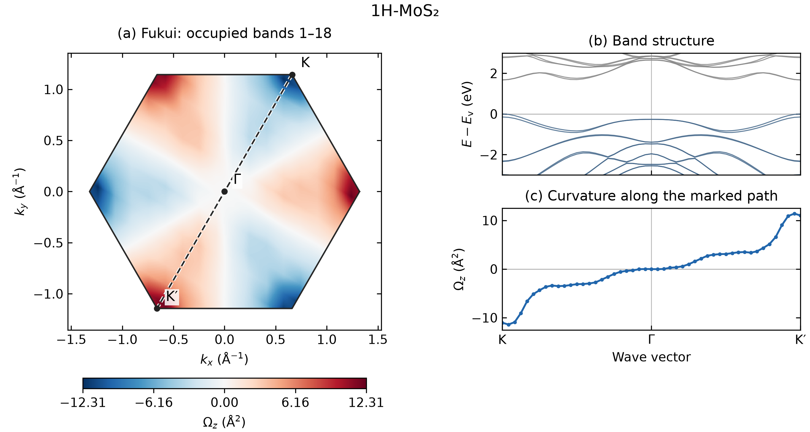
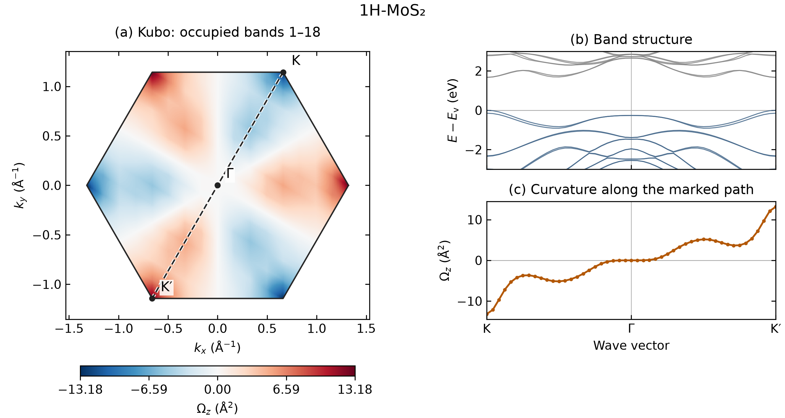
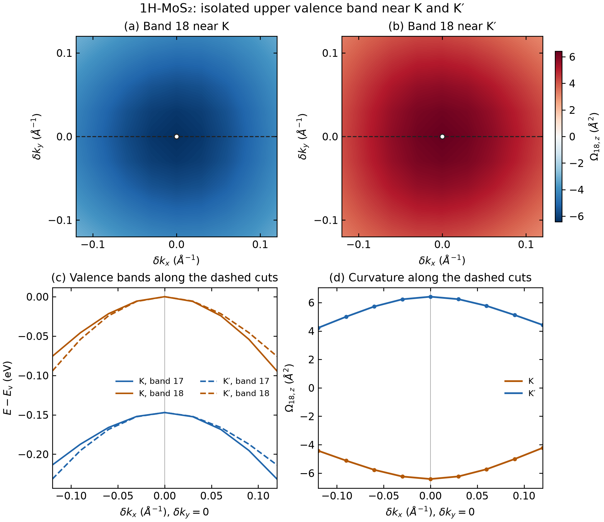
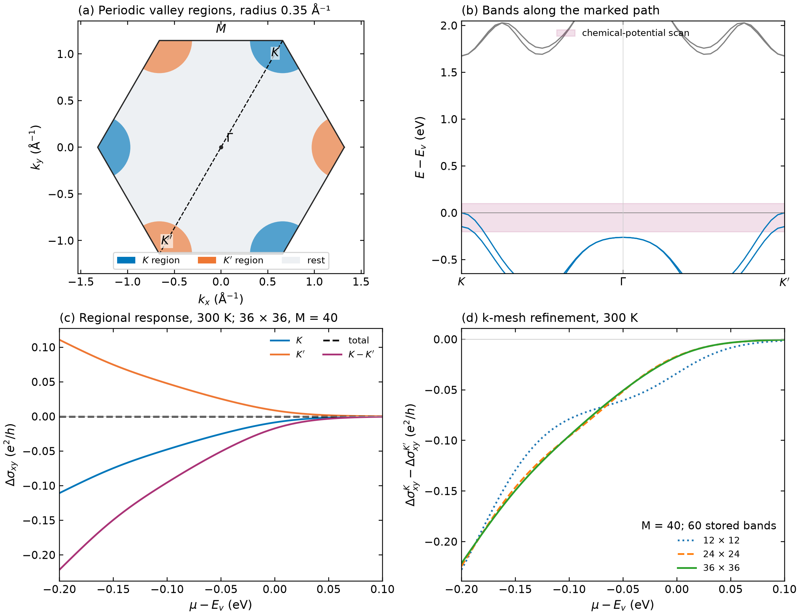
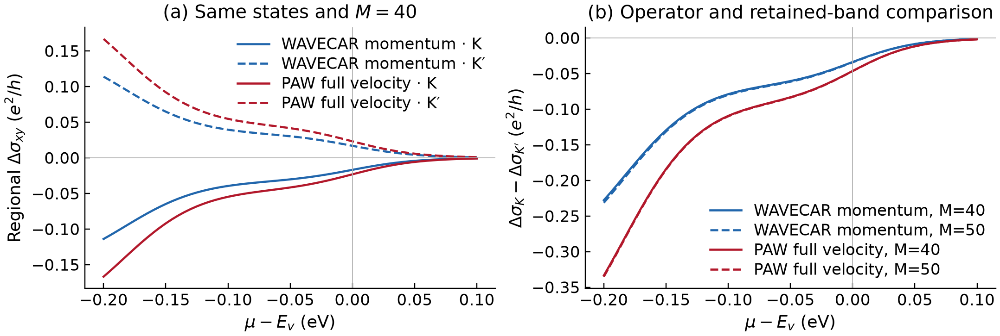
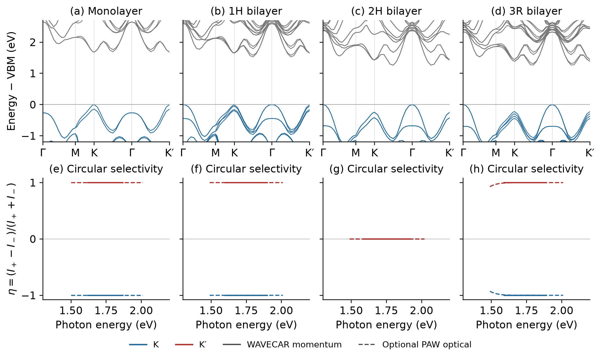
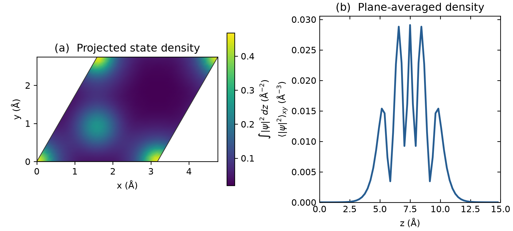
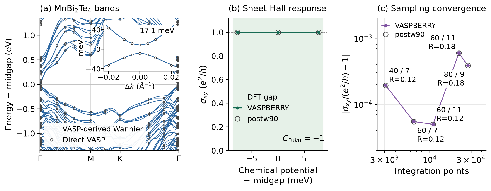

# Berry curvature and response functions from VASP wavefunctions

[Download the PDF report](TECHNICAL_REPORT.pdf).

## Abstract

VASPBERRY calculates Berry curvature, topological indices and response
properties directly from VASP wavefunctions. Its main workflow reads a
WAVECAR with the native Fortran executable and writes numerical results for
post-processing and plotting, without constructing a Wannier model. The
examples pair Fukui occupied-bundle Chern and Z₂ calculations with Kubo
curvature on Brillouin-zone meshes and symmetry paths. Native interband
matrix elements also support chemical-potential and temperature scans through
Python occupation weighting and integration. Circular optical selection and
real-space spinor densities complete the direct-wavefunction demonstrations.

Monolayer and bilayer MoS₂, a Bi bilayer and a three-septuple-layer MnBi₂Te₄
film illustrate these capabilities and their numerical limits. VASP supplies
the electronic structure; its band energies provide context for VASPBERRY's
topology and response results. Fukui integer invariants and pointwise Kubo
integrals answer different numerical questions: an integer invariant does
not establish a converged transport integral. Optional physical-operator
extensions and VASP-derived Wannier checks are documented separately in the
appendices. The report documents software capabilities and numerical
limitations with reproducible inputs, commands and reference results.

## 1. Methods

### 1.1 Berry curvature from wavefunction overlaps

The Fukui–Hatsugai–Suzuki method evaluates the Berry phase around each cell
of a periodic k mesh using overlaps between neighboring wavefunctions.
For an isolated group of bands, the overlap is a matrix and its determinant
gives a gauge-invariant loop phase. With the connection
$`\mathbf A=i\langle u|\nabla_\mathbf{k}u\rangle`$ used here,

```math
\Phi_p=-\arg\!\left(U_1(\mathbf k)
U_2(\mathbf k+\Delta\mathbf k_1)
U_1(\mathbf k+\Delta\mathbf k_2)^{-1}
U_2(\mathbf k)^{-1}\right),\qquad
\overline\Omega_p=\frac{\Phi_p}{\Delta S_k}.
```

The normalized link $`U_j`$ is the phase of the overlap determinant.
$`\Delta S_k=|\mathbf b_1\times\mathbf b_2|/(N_1N_2)`$ is the area of a mesh
cell, with reciprocal vectors containing $`2\pi`$. Thus $`\Phi_p`$ is a phase
and $`\overline\Omega_p`$ is an area-averaged curvature in Ų. The Chern number
is $`C=(2\pi)^{-1}\sum_p\Phi_p`$. An isolated occupied group can include internal
degeneracies; its separation from excluded bands remains essential.
The discrete construction and its band-group extension are described by
[Fukui, Hatsugai and Suzuki](https://doi.org/10.1143/JPSJ.74.1674).

The map and integral convey different information. A material can have strong
local curvature at opposite valleys while its total Chern number is zero.
The link construction supplies the lattice Chern invariant; the Kubo
integral is not rounded or adjusted to reproduce that integer. An integer
lattice Chern result also needs a sufficiently resolved mesh and
a physically appropriate isolated band group.

### 1.2 Native Kubo curvature and Hall post-processing

For an isolated band and a Cartesian Hamiltonian derivative
$`D_\alpha=\partial H/\partial k_\alpha`$,

```math
\Omega_{n,xy}(\mathbf k)=-2\,\mathrm{Im}
\sum_{m\ne n}\frac{D_{x,nm}D_{y,mn}}{(E_n-E_m)^2}.
```

This form resolves curvature at each sampled k point. Sharp curvature near
small gaps makes the k sampling and intermediate-band window particularly
important. Individual-band values are not used where the sampled bands
cannot be resolved separately. The native WAVECAR implementation uses
canonical momentum of the stored pseudo-wavefunctions; full material velocity
can require PAW, nonlocal and SOC terms. The exported-matrix interface permits
an explicitly supplied physical operator (Appendix A).

The ordinary WAVECAR route is the starting point for the charge-Hall examples
and requires no VASP source modification. Two optional comparisons extend
the operator description: standard VASP optical output for insulating
occupied bundles, and an instrumented producer for full velocity and spin
matrices. These input routes and their distinct scopes are summarized in the
[operator guide](OPERATOR_ROUTES.md). A more complete operator addresses an
operator approximation; its k-mesh and band-window convergence must still be tested.

For an isolated occupied bundle $`\mathcal V`$, the trace curvature is

```math
\Omega^{\mathcal V}_{xy}=-2\,\mathrm{Im}
\sum_{n\in\mathcal V}\sum_{m\notin\mathcal V}
\frac{D_{x,nm}D_{y,mn}}{(E_n-E_m)^2}.
```

Internal occupied-pair terms cancel in the sum of band curvatures. Excluding
them before division avoids singular individual-band terms at internal
degeneracies. The bundle must remain separated from the excluded bands.
This occupied-to-unoccupied formulation and its numerical advantage are
given by [Wang et al., Eq. (11) and Sec. III D](https://doi.org/10.1103/PhysRevB.74.195118).

For a two-dimensional system, the intrinsic charge sheet conductivity is

```math
\sigma_{xy}(\mu,T)=-\frac{e^2}{\hbar}
\sum_n\int_\mathrm{BZ}\frac{d^2k}{(2\pi)^2}\,
 f(E_{n\mathbf k}-\mu,T)\Omega_{n,xy}(\mathbf k).
```

Within an insulating gap at zero temperature, this becomes
$`\sigma_{xy}=-(e^2/h)C_\mathrm{occ}`$ in the stated convention. General
background on Berry curvature and electronic transport is given in
[Xiao, Chang and Niu](https://doi.org/10.1103/RevModPhys.82.1959).
The [Bi Hall example](../examples/features/hall-valley/) evaluates the occupied-group flux directly;
it does not assign independent curvatures to unresolved Kramers partners.

For chemical potentials crossing band edges, the Kubo implementation uses
unordered interband pairs. With $`N^{xy}_{nm}=-2\,\mathrm{Im}(D_{x,nm}D_{y,mn})`$,
the occupation-weighted integrand is
$`\sum_{n\lt m}(f_n-f_m)N^{xy}_{nm}/(E_n-E_m)^2`$.
Equal-occupation pairs cancel before division. Changes from a gap reference
are evaluated with occupation differences before summation. This preserves
small doping responses without subtracting large filled-band baselines.
The temperature enters only the Fermi function; the electronic structure
remains fixed. Regional contributions integrate the same charge response over
specified parts of the BZ, with a K−K′ difference defined without a factor of
one-half. Such a partition is not a separately conserved valley-current operator.

### 1.3 From a WAVECAR to reusable results

The direct-wavefunction workflow has four steps:

1. Calculate the electronic states with VASP, using a full periodic mesh
   for BZ integrals or an explicit path for local curvature and band context.
2. Read the WAVECAR with the native Fortran executable. Choose Fukui links
   for lattice topology, Kubo matrix elements for pointwise curvature and
   charge response, or the optical and wavefunction output modes.
3. Retain the original numerical samples. For charge transport, the Python
   pair processor applies occupations, temperature and BZ or regional weights
   to native matrix elements; this is part of the response calculation.
   The common Python interfaces provide CSV, DAT and NPZ results where
   supported, with units and represented bands recorded.
4. Plot those outputs beside the material's VASP band energies. Display
   interpolation may smooth a map, but does not replace the sampled data
   used for integration or convergence checks.

The current repository build provides the following `--task` selectors:

| Native task | Numerical output |
|---|---|
| `chern` | Fukui occupied-bundle flux, curvature and Chern number |
| `z2` | Fukui–Hatsugai integer field and half-zone parity |
| `kubo` | Pointwise band or bundle curvature on a mesh or path |
| `kubo-pairs` | Interband-pair data for Python charge-Hall integration |
| `optical` / `spectrum` | Circular transition selectivity / broadened spectra |
| `wavefunction` | Selected Γ-state amplitudes for density plots |

For example, `build/vaspberry --task kubo` selects the native pointwise
calculation; supply the WAVECAR and band options listed in the
[usage guide](../README.md#usage) and [worked examples](../examples/README.md).
The task aliases refer to the current repository version; the immutable
v1.3.0 release uses the retained legacy flags.

These stages require no Wannier localization. Python prepares inputs,
normalizes outputs and performs the stated post-processing. Optional
standard-WAVEDER, supplied physical-matrix and Wannier interfaces use
additional Python numerical backends with input requirements described in
[Appendix A](#appendix-a-optional-physical-operator-extensions) and
[Appendix B](#appendix-b-optional-wannier-supporting-validation).

## 2. Materials and numerical settings

| Dataset | Wavefunctions and sampling | Quantities shown |
|---|---|---|
| Monolayer MoS₂, full zone | SOC; 12×12 mesh; 26 bands; 400 eV | Fukui and Kubo occupied-bundle curvature, bands 1–18 |
| Monolayer MoS₂, matching path | SOC; 49 K–Γ–K′ points; 26 bands; 400 eV | VASP band structure and Kubo curvature beside the maps |
| Monolayer MoS₂, local valleys | SOC; two 9×9 patches; 26 bands; 400 eV | Isolated band-18 curvature near K and K′ |
| Monolayer MoS₂, transport | SOC; 12×12 to 36×36 meshes; stored and retained band windows varied separately; 400 eV | Chemical-potential and temperature dependence of regional Hall response |
| Monolayer MoS₂, operator comparison | Same 12×12 SOC eigenstates; 60 stored bands; pairs within 1–40 or 1–50; 400 eV | Ordinary WAVECAR and optional full PAW velocity Hall curves |
| MoS₂ stacking comparison | Monolayer and 1H, 2H, 3R bilayers; PBE+SOC; separate 6×6 SCF densities; 49 Γ–M–K–Γ–K′ points; 60/64 path bands; 400 eV | VASP bands and circular optical selection from WAVECAR and standard WAVEDER |
| Monolayer MoS₂, supplied path | SOC; 48 K–Γ–K′ points; 32 bands; 400 eV | Γ-point state density; original optical tutorial |
| Buckled Bi bilayer | Two atoms; PBE+SOC; 400 eV; fresh 12×12 SCF density; full 6×6, 12×12 and 18×18 meshes; occupied bands 1–10 | Native Z₂ n-field; optional PAW spin response in Appendix A |
| MnBi₂Te₄, three septuple layers | SOC+U; 21 atoms; full 6×6 VASP mesh; 192 bands; occupied bands 1–123; 270 eV | Occupied WAVECAR Fukui invariant; coarse optical-integral diagnostic |

The [input guide](../examples/INPUTS.md) links the structures and VASP files.
The MoS₂ maps and their matching path use the same public SCF charge density,
structure, potentials, cutoff and 26-band window. VASP 5.4.4 generated the
12×12 mesh and 49-point path with `ICHARG=11` and `ISYM=-1`; only the k-point
list changes. The sampled occupied-to-empty direct gap is 1.674 eV. The
tutorial supplies preparation files and commands for both WAVECARs.
The stacking examples use fixed, documented idealized structures and a common
24 Å cell height. The 3R slab additionally uses a self-consistent z dipole
correction. These small path calculations illustrate optical analysis across
input systems; no structural or full-zone response convergence is asserted.
The [stacking guide](../examples/materials/mos2-stacking-valley/) provides the
geometries and complete VASP workflow. The real-space example and original
optical tutorial retain the separate supplied 32-band path.

The optional Bi and MnBi₂Te₄ Wannier representations and their
separate interpolation checks are described in Appendix B. Their model
construction is additional to the WAVECAR workflows in the main text.

## 3. Results from VASP wavefunctions

### 3.1 MoS₂: Fukui Berry curvature over the full Brillouin zone



**Figure 1.** (a) Fukui Berry curvature of occupied bands 1–18 in the
Cartesian first Brillouin zone. The dashed line marks K–Γ–K′, with
K = (1/3, 2/3) and K′ = −K in reciprocal coordinates. Native 12×12 plaquette
values are displayed with periodic bilinear interpolation onto a 401×401
Cartesian grid. (b) VASP band structure along that path;
energies are relative to the valence-band maximum, with occupied bands in
blue and empty bands in gray. (c) A periodic bilinear cut of the plaquette
field along the marked path. This line visualizes panel (a), rather than
adding an independent pointwise curvature calculation. Both right-hand
panels share the same Cartesian path distance.

The curvature has opposite signs near the time-reversed K and K′ valleys.
The largest sampled magnitudes are approximately **12.31 Ų**, while the
full-zone Chern number is zero to numerical precision. The native text map
integrates to approximately −5 × 10⁻⁷ after decimal rounding. This illustrates the distinction between
valley-contrasting local geometry and vanishing total charge Chern number.
The connection between inversion breaking, spin–orbit coupling and valley
optical response in MoS₂ is discussed by
[Xiao et al.](https://doi.org/10.1103/PhysRevLett.108.196802).
The present map is a finite-mesh example rather than a convergence study.

[Calculation and plotting commands](../examples/features/fukui-berry-curvature/)

### 3.2 MoS₂: Kubo curvature of the occupied valence-band bundle



**Figure 2.** (a) Canonical-momentum Kubo trace curvature of occupied bands
1–18 on the 12×12 mesh. Only transitions to the stored empty bands 19–26
enter the sum. The map uses the same periodic bilinear display interpolation
and dashed K–Γ–K′ path as Figure 1. (b) VASP band structure, with occupied bands
in blue and empty bands in gray. (c) Bundle curvature calculated directly
at all 49 path points. Internal valence-band degeneracies do not interrupt
the bundle curve.

The occupied-bundle curvature is approximately **−13.18 Ų at K** and
**+13.18 Ų at K′**. The occupied space stays separated from the empty states
by at least **1.674 eV** on both samplings, so every mesh and path point is
valid for the bundle calculation. The native option `-kubo_bundle 1` performs
the external-band sum directly, avoiding large cancelling internal terms.

Figures 1 and 2 describe the same occupied band space. Their numerical
values need not coincide at this resolution: Fukui gives finite-plaquette
averages, while this Kubo result uses pointwise canonical momentum and a
finite empty-band window. The 12×12 mesh and 26 stored bands require
convergence for quantitative predictions. NumPy interpolation smooths only
the display; all integration and numerical checks use the original samples.

[Calculation and interpretation](../examples/features/kubo-curvature/)

#### 3.2.1 MoS₂: an isolated single band near the valleys



**Figure 3.** Single-band Kubo curvature of the upper valence band, band 18,
around K and K′. Each local Cartesian patch extends ±0.12 Å⁻¹ and contains
9×9 VASP points. The upper maps use NumPy bilinear display interpolation;
the dashed lines mark the cuts below. The lower panels show the two upper VASP
valence bands near both valleys and band-18 curvature at both valleys. Symbols mark
the calculated curvature samples.

Band 18 touches its Kramers partner at Γ, but is separated from every other
stored band by at least **0.130 eV** throughout these valley patches. The
17–18 splitting at K is **0.147 eV**, and the valley curvatures are
approximately **−6.415/+6.415 Ų at K/K′**. This is a suitable local single-band example of
the spin-split valley physics described by
[Xiao et al.](https://doi.org/10.1103/PhysRevLett.108.196802).
The patch data describe local curvature; a full-zone integral requires
the appropriate isolated band bundle and complete BZ sampling.

[VASP preparation, calculation and reference data](../examples/features/kubo-curvature/valleys/)

#### 3.2.2 MoS₂: intrinsic charge and regional valley Hall response



**Figure 4.** (a) Cartesian first BZ with periodic K/K′ disks of radius
0.35 Å⁻¹ and the marked K–Γ–K′ line. (b) The matching 26-band VASP dispersion,
with the chemical-potential interval shaded. (c) Regional Hall changes at
300 K on the 36×36 mesh, using 60 stored bands and pairs within bands 1–40.
(d) Mesh refinement at that fixed band window. Energies are relative to each
source's valence-band maximum; the band path uses the same density and cutoff.

The native Fortran calculation supplies the interband pairs; Python
post-processing applies occupations and integrates their contribution over
the full zone and the specified regions. The 61-point scan covers $`E_v-0.20`$ to $`E_v+0.10`$ eV at 0 and 300 K.
We define $`\Delta\sigma(\mu)=\sigma(\mu)-\sigma(\mu_{\rm ref})`$ with a midgap
reference, and the valley difference as $`\Delta\sigma_K-\Delta\sigma_{K'}`$.
The total charge response remains below **$`2.24\times10^{-9}\,e^2/h`$**,
consistent with time-reversal symmetry. Numerical tables also give absolute
conductivities and carrier counts.

Two numerical choices were varied separately at 300 K. The relative L2
difference below is the norm of the curve change divided by the finer curve's
norm, on a common $`\mu-E_v`$ grid.

| Test | Refinement | Relative L2 change |
|---|---|---:|
| k mesh; 60 stored bands, pair cutoff 40 | 12×12 → 24×24 | 12.89% |
| k mesh; same band window | 24×24 → 36×36 | 1.482% |
| Pair cutoff; one 12×12, 96-band source | 60 → 80 | 1.263% |
| Pair cutoff; same source | 80 → 90 | 0.202% |

The final mesh change exceeds the stated 1% criterion. The last cutoff
increment is below 1%; these separate tests do not establish joint
convergence. The [reference guide](../examples/features/kubo-hall/) includes
the commands and additional checks on empty-state accuracy and numerical
degeneracy grouping.

This rigid-band response uses canonical momentum, omitting PAW augmentation
and nonlocal/SOC velocity terms. Numerical refinement does not remove those
approximations. The [supplementary plot](../examples/features/kubo-hall/reference/figures/mos2-hall-checks.pdf)
retains the finite-mesh steps at 0 K.

#### 3.2.3 Optional comparison: matching the current operators



**Figure 5.** Charge response from the same final VASP eigenstates on a
12×12 mesh, with 60 stored bands, at 300 K. (a) Regional changes for
K and K′ using pairs within bands 1–40. (b) The K−K′ difference with
retained cutoffs $`M=40`$ and 50. Blue curves use ordinary WAVECAR canonical
momentum; red curves use the optional full PAW velocity matrices. Geometry,
density, occupations, region definitions and eigenstates are identical.

At $`\mu-E_v=-0.20`$ eV and $`M=40`$, the regional difference changes from
**−0.22779 to −0.33363 $`e^2/h`$** when the full velocity replaces canonical
momentum. Both total charge responses remain below
$`1.1\times10^{-8}\,e^2/h`$, without time-reversal averaging. The nonzero
regional response therefore reveals an operator difference that the
symmetry-enforced total cannot test.

For the complete 300 K difference curve, increasing $`M`$ from 40 to 50
changes the canonical and PAW results by **1.445% and 0.465%**, respectively,
using the same relative-L2 definition as above. At $`M=50`$, the two operators
differ by 29.44% relative to the PAW curve. These measurements describe one
fixed mesh and band increment. They do not establish k convergence or a
general advantage in convergence rate.

The full-velocity route includes the supported PAW, nonlocal and SOC
operator terms, giving a more complete current description. Generating its
input uses the optional VASP instrumentation; ordinary WAVECAR remains the
starting workflow. The [separate comparison guide](../examples/features/kubo-hall/operator-comparison/)
provides preparation instructions, both reusable pair caches and the original
CSV/DAT/NPZ results. Their integration can be repeated without VASP.

### 3.3 MoS₂: circular optical selection across layer stackings

The native optical calculation resolves left- and right-circular transitions
from the WAVECAR momentum matrix elements. Circular selectivity is their
intensity difference divided by their sum. The same analysis can be repeated
with standard VASP optical matrices as an optional comparison.



**Figure 6.** (a–d) VASP bands of monolayer and 1H, 2H and 3R bilayer MoS₂
along Γ–M–K–Γ–K′, with each case referenced to its own sampled VBM.
(e–h) K/K′ circular selectivity under normal incidence, from ordinary
WAVECAR momentum (solid) and optional standard WAVEDER matrices (dashed).
Transitions use occupied bands 1–18 to 19–20 for monolayer, and 1–36 to
37–40 for all bilayers, with Gaussian σ = 0.05 eV. Weak spectra and native
ratios limited by printed intensity precision are masked; overlapping
curves retain their calculated values.

The near-edge peaks lie at **1.67–1.68 eV**. Monolayer and 1H show
$`\eta\simeq-1/+1`$ at K/K′; the 3R PAW peak gives **−0.99884/+0.99884**.
For the inversion-symmetric 2H control, summing the complete occupied and
empty groups cancels the selectivity: the PAW peak residual is below
**$`5\times10^{-7}`$** at both valleys. This illustrates why the response of
an unresolved degenerate group must include every partner.

The stacking comparison extends one optical workflow to several VASP input
systems. It is motivated by the 1H bilayers reported by
[Yang et al.](https://doi.org/10.1038/s41586-026-11069-3), using fixed idealized
geometries for the present software demonstration. It does not reproduce
the paper's direct-gap prediction or measured photoluminescence polarization.
Earlier figures already demonstrate curvature and Hall integration; those
maps are not repeated for each stacking.

The optional PAW optical calculation uses ordinary VASP output and requires
no source modification. Its comparison with native momentum tests helicity
and symmetry. The two spectral definitions have different finite-broadening
weights, so their ratio differences do not isolate an operator correction
and their absolute intensities are not equated. The
[stacking guide and reference spectra](../examples/materials/mos2-stacking-valley/)
provide complete VASP inputs, both channel spectra and reproduction commands;
the original [monolayer optical tutorial](../examples/features/circular-dichroism/)
remains the introductory example.

### 3.4 Bi: native Fukui–Hatsugai Z₂ topology

The two-atom buckled Bi bilayer provides a compact real-material example of
quantum spin Hall topology, as proposed by
[Murakami](https://doi.org/10.1103/PhysRevLett.97.236805). We use the fixed Bi
geometry and a fresh nonmagnetic PBE+SOC calculation, with a 400 eV cutoff
and electronic tolerance of $`10^{-8}`$ eV. The native calculation reads the resulting VASP spinor wavefunctions
directly from WAVECAR.

VASPBERRY evaluates the
[Fukui–Hatsugai lattice n-field](https://doi.org/10.1143/JPSJ.76.053702)
from the occupied SOC bands 1–10 on a full Γ-centered 12×12 mesh.
With the time-reversal-compatible gauge used in this construction, the
Z₂ invariant is the parity of the integer-field sum over a half Brillouin zone:

```math
\nu=\left[\sum_{p\in B_{1/2}} n(p)\right]\bmod 2.
```


**Figure 7.** Fukui–Hatsugai integer field $`n(\mathbf k)`$ calculated from the
Bi VASP spinor wavefunctions. Red, white and blue denote +1, 0 and −1,
respectively. The native plaquettes are displayed without interpolation in
dimensionless reduced coordinates, $`\mathbf k=q_1\mathbf b_1+q_2\mathbf b_2`$,
with opposite edges periodically identified. The line at $`q_2=0`$ separates
the upper and lower half zones. The occupied-band calculation gives **Z₂ = 1**.

The upper and lower half-zone sums are **−3 and +3**, respectively. Both are odd,
so their parities agree at **$`\nu=1`$**, identifying the nontrivial
time-reversal-symmetric insulating phase for this calculation.
The sampled minimum direct and global gaps are **0.535 eV** and **0.497 eV**.

The local n-field depends on the gauge and logarithm branch; its half-zone
parity is the invariant. The reduced-coordinate map shows the original mesh
half-zones used for these sums. The [separate occupied **C = 0** calculation](../examples/materials/bi-spin-hall/reference/fukui/README.md) and zero charge-Hall
response are consistent with this nontrivial Z₂ result.

The native topology calculation uses WAVECAR pseudo-wavefunction overlaps.
An independent check of the original occupied subspaces, before the native
TR reconstruction, gives a maximum time-reversal residual of
$`4.57\times10^{-8}`$. The optional spin Hall calculation in Appendix A.3 uses
physical spin and velocity matrices with the PAW terms described in
Appendix A.2. The older Bi fixture remains a
separate historical reference.

[Actual Bi preparation and commands](../examples/materials/bi-spin-hall/) ·
[Numerical n-field](../examples/materials/bi-spin-hall/reference/z2/Z2_FIELD.csv)

The native occupied-subspace calculation establishes the bulk Z₂ result
shown here. Optional edge connectivity corroborates it in Appendix B.2;
conventional spin Hall conductivity is a separate observable and need not
be quantized when spin is not conserved (Appendix A.3).

### 3.5 MoS₂: a real-space Γ state



**Figure 8.** Projected pseudo-wavefunction density of band 18 at Γ and its
plane average along z. The in-plane plot uses the Cartesian geometry of the
oblique primitive cell. Both spinor components are retained.

The integrated pseudo-density is approximately **0.8258**, consistent with
the plane-wave coefficient norm. The PAW augmentation is not part of this
plot, so a unit density integral is not imposed. The example illustrates
conversion of complex amplitudes into a physical-coordinate density map.

[Wavefunction calculation guide](../examples/features/wavefunction/)

### 3.6 MnBi₂Te₄: occupied-bundle Fukui Chern number

This example demonstrates a nonzero Chern invariant of the complete
occupied VASP band space. The three-septuple-layer MnBi₂Te₄ film has 21 atoms
with +z/−z/+z Mn magnetization. Its fixed, unrelaxed geometry retains bulk
vertical spacings from Yan et al., with in-plane $`a=4.336`$ Å, PBE+SOC and
Mn $`U_{\rm eff}=5.34`$ eV following Otrokov et al. It is distinct from the
relaxed films in that study.

The VASP gap is **17.10 meV**. Fukui links of the **complete occupied
valence-band bundle, bands 1–123, give C = −1**, corresponding to
$`\sigma_{xy}=+e^2/h`$ in our convention. A direct 6×6 PAW optical integral
instead gives **163.109 $`e^2/h`$**: the Γ-point curvature reaches approximately
$`-1.52\times10^4`$ Ų, and this coarse mesh overweights the narrow peak.
This optical result is a convergence diagnostic, not a quantized response.
An integer Fukui result does not establish convergence of the pointwise
Kubo integral, and no integer value is imposed on that integral.

The native Fortran calculation evaluates overlap determinants directly in
the complete VASP occupied space. Its **C = −1** result and all 36 plaquette
fluxes agree with the independent Python wavefunction-Fukui reference within
the native map's printed precision. The separately checked deep bands 1–36
form a C = 0 bundle. The
[native output and comparison](../examples/materials/mnbi2te4-qah/reference/native-fukui/)
and [material guide](../examples/materials/mnbi2te4-qah/)
provide the actual command, VASP inputs, overlap diagnostics and
standard-WAVEDER coarse-mesh result.

The main lesson is the distinction between occupied-bundle topology and
response integration. The optional dense Wannier calculation in Appendix B.3
checks the expected Hall value within a supplied finite model; it is not
needed to perform the direct-wavefunction workflows above and does not
establish convergence of this coarse VASP optical integral.

## 4. Practical use

Begin with the [example guide](../examples/README.md), reproduce the chosen
quantity, and then select the sampling and band window appropriate to your
own material. Use Cartesian reciprocal-space maps to display lattice symmetry,
named k paths for band-resolved quantities, and energy or chemical potential
for spectra and transport. State units, represented bands, temperature and
broadening in the caption.

Start with WAVECAR and the native executable for Fukui topology, Kubo
curvature, optical selection and state densities. For charge Kubo transport,
export the native interband pairs and use the Python occupation/integration
step to scan chemical potential and temperature without repeating the
matrix-element calculation. These main workflows do not require Wannier90.
Optional standard optical or full transition-matrix inputs allow additional
operator terms to be assessed on matching electronic states. The
[operator guide](OPERATOR_ROUTES.md) links the input requirements and
separate instructions for each route.

For quantitative conclusions, converge the VASP electronic structure,
k mesh and relevant band window. The examples show how the methods are used;
the [supplementary analytic references](REFERENCE_MATERIALS.md) check formulas
and conventions, while [validation details](VALIDATION_1.3.0.md) document the
numerical implementation. Detailed execution records remain alongside the
numerical files for reproducibility.

## Appendix A. Optional physical-operator extensions

These additional routes address the operator content of response functions.
They complement the native WAVECAR examples; they are not prerequisites for
Fukui topology or canonical-momentum Kubo analysis. Standard WAVEDER needs no
VASP source change. Full velocity and PAW spin inputs use the separately
documented instrumented producer. Their Python backends and convergence
conditions are explicit below; the matched charge comparison remains in
Section 3.2.3 so readers can assess its effect on the native baseline.

### A.1 Standard VASP optical matrices

For an insulating occupied bundle, the supported standard VASP longitudinal
optical calculation supplies matrix elements
$`C_{cv,\alpha}=\langle u_c|\partial_{k_\alpha}u_v\rangle`$ in Å. Here $`v`$ and
$`c`$ label occupied and empty states. Their contribution to the trace is

```math
\Omega^{\rm occ}_{xy}=-2\,\mathrm{Im}
\sum_{v,c} C_{cv,x}^{*} C_{cv,y}.
```

The energy denominator is already contained in these derivatives. The
longitudinal PAW optical expression includes projector and augmentation terms,
as described by [Gajdoš et al.](https://doi.org/10.1103/PhysRevB.73.045112).
This standard `WAVEDER` route needs no VASP source modification.
The `waveder-hall` command checks the actual VASP output, occupied filling and
global gap before integration. Its present scope is VASP 5.4.4, zero
temperature and a fixed insulating bundle; the occupied–empty separation
must exceed the producer's 2 meV degeneracy threshold. Mesh and empty-state
convergence remain separate requirements.

The same standard optical matrices provide circular transition spectra at
each k point. For propagation along +z and
$`\boldsymbol\epsilon_\pm=(\hat x\pm i\hat y)/\sqrt2`$,

```math
I_\pm(\mathbf k,E_\gamma)=\sum_{v,c}
\left|\frac{C_{cv,x}\pm i C_{cv,y}}{\sqrt2}\right|^2
g_\sigma\!\left(E_\gamma-E_c+E_v\right),\qquad
\eta=\frac{I_+-I_-}{I_++I_-}.
```

Here $`g_\sigma`$ is a normalized Gaussian. Complete initial and final band
groups are summed before forming $`\eta`$, which is essential at degeneracies.
These k-resolved strengths are independent-particle quantities; they do not
include excitons or emission kinetics. The ordinary WAVECAR calculation uses
canonical momentum with its native photon-energy normalization. The
[optical guide](PAW_OPTICS.md) specifies both conventions and their comparison.

### A.2 PAW spin matrices and conventional spin Hall response

The conventional spin current is $`J_i^a=\{s_a,v_i\}/2`$, with
$`s_a=\hbar\sigma_a/2`$. In SOC systems its matrix elements require the
full complex spin matrix, including off-diagonal band elements. Multiplying
charge Berry curvature by a spin expectation value is generally insufficient.
This current definition and its first-principles evaluation are discussed by
[Qiao et al.](https://doi.org/10.1103/PhysRevB.98.214402) and
[Ryoo, Park and Souza](https://doi.org/10.1103/PhysRevB.99.235113).

The two WAVECAR spinor components directly give the pseudo matrix
$`\widetilde\Sigma^a_{nm}=\sum_{\mathbf Gss'} c^*_{n\mathbf Gs}(\sigma_a)_{ss'}c_{m\mathbf Gs'}`$.
The physical PAW matrix additionally requires the on-site correction

```math
\Sigma^a_{nm}=\widetilde\Sigma^a_{nm}
+\sum_{Aijss'}p^{A*}_{ni,s}\Delta Q^A_{ij}(\sigma_a)_{ss'}p^A_{mj,s'},
\quad
\Delta Q^A_{ij}=\langle\phi^A_i|\phi^A_j\rangle
-\langle\widetilde\phi^A_i|\widetilde\phi^A_j\rangle.
```

Here $`p`$ denotes the same-run PAW projector overlap. This expression is
$`T^\dagger\sigma_aT`$ for the supported spin-independent PAW transformation.
The implementation checks the corresponding physical overlap and preserves
the raw pseudo-state norms. For this optional route, the supplied producer
recipe instruments a separately licensed VASP 5.4.4 source copy. The ordinary
WAVECAR and standard `WAVEDER` charge workflows do not need that instrumentation.

For transport, $`D_i=\hbar v_i`$ includes PAW and nonlocal/SOC velocity terms.
The producer retains the velocity before the optical energy-denominator
division, including diagonal and exactly degenerate blocks. These blocks
cannot be recovered from an optical connection that has already discarded
them. Within the supplied source-band space $`P`$, VASPBERRY forms
$`K_i^a=\{P\Sigma^aP,PD_iP\}/2`$. This finite-band product omits the
$`P\Sigma^aQD_iP`$ and $`PD_iQ\Sigma^aP`$ terms, where $`Q=1-P`$.
Increasing the source-band window therefore tests both current-product
closure and the intermediate-state sum.

For the complete occupied group $`\mathcal V`$, the implementation evaluates

```math
\Omega^a_{ij}=-2\,\mathrm{Im}
\sum_{n\in\mathcal V,m\notin\mathcal V}
\frac{K^a_{i,nm}D_{j,mn}}{(E_m-E_n)^2},\qquad
\frac{\sigma^a_{ij}}{(\hbar/e)(e^2/h)}
=\frac{A_{\rm BZ}}{4\pi}\sum_{\mathbf k}w_{\mathbf k}\Omega^a_{ij}(\mathbf k).
```

Internal equal-occupation terms cancel before division. The formula uses
$`e>0`$, physical electron charge $`-e`$, Pauli matrices without an embedded
$`\hbar/2`$, and $`D`$ in eV Å. The curvature-like tensor is in Ų. In a conserved
$`\sigma_z=+1`$ sector, this normalized spin coefficient is minus one half of
the charge coefficient in Section 1.2. No additional spin degeneracy or
integer rounding is applied. The present command supports a fixed insulating
2D bundle at zero temperature. Its operator, gauge, units, sampled gap and
band coverage are recorded with the numerical output.

Z₂ topology and conventional spin Hall response are separate tests. A
nontrivial time-reversal invariant insulator need not have an exactly
quantized bulk spin Hall coefficient when spin is not conserved. The
optional ideal-edge check in Appendix B.2 addresses boundary connectivity,
not a finite-device conductance. The [spin Hall guide](SPIN_HALL.md)
gives the operator contract and reproduction commands.

### A.3 Bi: optional spin Hall conductivity and convergence


**Figure 9.** (a) Occupied-bundle spin Berry curvature $`\Omega^z_{xy}`$ from
PAW spin and full velocity matrices on the 12×12 VASP mesh, shown in the
Cartesian first BZ. Periodic bilinear interpolation is used only for the
color map. (b) Mesh refinement retaining 48 bands from 64-band VASP sources.
(c) Retained-band studies from 48- and 80-band VASP sources at a fixed 6×6 mesh. The numerical integrals always use the
original k points and weights.

Retaining 48 states from 64-band VASP calculations, the 6×6, 12×12 and
18×18 meshes give $`\sigma^z_{xy}=1.382558`$, $`0.690723`$ and $`0.647020`$ in
$`(\hbar/e)(e^2/h)`$. The last change is 0.04370, or 6.75% of the 18×18 value.
**These meshes do not establish a converged spin Hall conductivity.**
The main difficulty is the narrow response near Γ: its local value stays
near 245.9 Ų, but its weighted contribution falls from 1.286413 to 0.321603
and 0.142934. The nearest sampled radius falls from 0.276 to 0.138 and
0.092 Å⁻¹. Smoothing the plot cannot supply the missing integration resolution.

The band study probes a different error. At fixed 6×6 sampling, retaining
40, 44 and 48 bands from the 48-band source gives 1.386328, 1.384098 and
1.382555. Increasing the actual VASP source to 64 bands while retaining the
same first 48 changes the response by only $`2.64\times10^{-6}`$. The uppermost
new empty states fail a Kramers-pair accuracy check. An 80-band VASP run
resolves the first 64 states: retaining 48, 56 and 64 gives 1.382558,
1.383047 and 1.381001, with a final change of 0.15%. Only the verified
subspace is used; an electronic stopping criterion alone does not establish
accuracy of every stored empty state.
Neither band stability nor an integer Z₂ invariant establishes k convergence.

The 12×12 charge response is $`1.82\times10^{-7}\,e^2/h`$, consistent with the
vanishing anomalous charge Hall effect of this nonmagnetic system. With
64 source bands and the accurate first 48 retained, that residual falls to
$`-2.29\times10^{-12}\,e^2/h`$; the 18×18 residual is
$`4.91\times10^{-9}\,e^2/h`$, without time-reversal averaging. The finite
spin response uses a different current vertex and is allowed by time reversal.
Its noninteger value is not a failed Chern-number calculation. The finite-band
current-product approximation, conventional-current definition, sampling and
operator scope remain explicit in the output.

The supplied actual 6×6 and 12×12 PAW matrix bundles reproduce the VASPBERRY
integration without rerunning VASP. The fresh SCF density, VASP input
preparation and original producer insertion routines document the earlier
stages; the additional Wannier inputs belong to the separate check in
Appendix B.2. Every response component was independently recomputed
from the raw exported matrices; all 27 spin components agree to within
$`3.1\times10^{-14}`$ in the stated sheet units. A separate finite-k check of
the diagonal velocity gives a maximum error of $`1.74\times10^{-4}`$ eV Å.
The latter is a producer validation on development test points, not a material
convergence result.

[Spin Hall reproduction guide](../examples/materials/bi-spin-hall/) ·
[Numerical conventions](SPIN_HALL.md) ·
[Validation details](VALIDATION_1.3.0.md)

## Appendix B. Optional Wannier supporting validation

The calculations in this appendix require an additional VASP-derived
Wannier model. External Wannier90 prepares the representation; VASPBERRY
imports the supplied Hamiltonian and position matrices and evaluates the
stated quantities itself. It neither generates the VASP electronic states
nor performs Wannier localization. These checks support bulk topology and
response verification while the main user workflow remains direct WAVECAR
analysis.

### B.1 Full-connection evaluation of the supplied model

As a separate supporting route, VASPBERRY interpolates the Hamiltonian
and position matrices of a VASP-derived Wannier model. Its own Fourier,
diagonalization and occupied-trace routines evaluate $`\Omega=J0+J1+J2`$:
the basis-connection curl, the mixed connection/Hamiltonian-derivative term,
and the derivative-pair term. Only occupied-to-empty denominators occur;
internal degeneracies are allowed. The formulation follows
[Wang et al.](https://doi.org/10.1103/PhysRevB.74.195118) and
[Lopez et al., Eq. (51)](https://doi.org/10.1103/PhysRevB.85.014435).
Bands and local curvature are checked against direct VASP data. The separate
`postw90` calculation in [Wannier90](https://doi.org/10.1088/1361-648X/ab51ff)
provides an independent check of VASPBERRY's evaluation of the same finite model.

### B.2 Bi: ideal-edge support for the native bulk Z₂ result

The auxiliary model uses 16 s/p spinor orbitals and a 6×6 VASP training
mesh; independent 12×12 and 18×18 VASP comparisons test its dispersion.
Finite strips of 20 and 40 cells test the width dependence.


**Figure 10.** (a) Bi band structure from a VASP-derived 16-orbital Wannier
Hamiltonian along Γ–M–K–Γ. Circles show direct VASP energies on the independent
12×12 mesh; all ten occupied bands are retained in the model. (b) Spectral
weight in the first two cells of a 40-cell strip, periodic along the first
lattice vector and open along the second. All eigenstates are summed before
applying a 10 meV Gaussian display broadening. Energy zero is the midpoint
of the sampled VASP bulk gap. The edge branches connect the valence and
conduction manifolds across that gap.

The separation of the central Kramers doublets at Γ falls from 7.354 meV
for a 20-cell strip to 0.03046 meV for 40 cells. Three crossings per edge
occur over the positive half of the one-dimensional BZ at each of three
test energies inside the bulk gap. This odd, edge-localized connectivity
corroborates **Z₂ = 1** and the time-reversal-protected boundary modes expected
for this phase. The edge calculation is a supporting check of the bulk
topology in Figure 7.

The VASP-derived interpolation was checked on separate 12×12 and 18×18
meshes: its sampled gaps differ from VASP by at most 2.426 meV and bands
9–12 by at most 33.23 meV. Localization stopped before its requested spread
tolerance. The strip represents an ideal truncation of bulk hoppings, with
no edge relaxation or device contacts. The [Bi reproduction guide](../examples/materials/bi-spin-hall/)
retains the complete interpolation, symmetry and strip-width checks.

### B.3 MnBi₂Te₄: dense integration of a supplied finite model

Section 3.6 gives the complete occupied-wavefunction invariant C = −1 and
the unresolved coarse optical integral. This optional calculation tests the
corresponding Hall expectation with a VASP-derived Wannier representation.



**Figure 11.** (a) VASP-derived Wannier band structure along Γ–M–K–Γ, with direct
VASP checks; the inset resolves the K–Γ–M gap near Γ. (b) VASPBERRY
full-connection sheet Hall response at three chemical potentials inside the
gap, at zero temperature; open markers show the independent `postw90`
comparison. The dashed line is the topological expectation. (c) Deviation
$`|\sigma_{xy}/(e^2/h)-1|`$ under integration refinement. Labels give the base
mesh, local subdivision and Γ-region radius in Å⁻¹. Both solvers use the
same model and weights; their agreement is distinct from mesh convergence.

For dense integration, VASPBERRY's `wannier-hall` evaluates all J0/J1/J2
terms from the supplied VASP-derived Hamiltonian and position matrices.
`wannier-bands` evaluates the plotted interpolation of the same VASP-derived
electronic structure. The model
contains 138 orbitals and **87 occupied states**; the omitted 36 deep VASP
bands form a separately checked C = 0 bundle. Near Γ, direct VASP band edges
agree within 1.26 meV and local curvature within 1.44%; the latter comparison
retains the full-123 versus model-87 subspace difference. The maximum
band-edge difference across all twelve validation locations is 18.14 meV.

VASPBERRY's final 27,600-point result is
**$`\sigma_{xy}=1.000384978\,e^2/h`$** at all three gap chemical potentials.
It uses an 80×80 base mesh and 9×9 subdivisions in the 0.18 Å⁻¹ Γ region.
The last refinement changes the result by **$`2.07\times10^{-4}\,e^2/h`$**,
below the stated $`10^{-3}\,e^2/h`$ comparison criterion. The nonmonotonic
region-expansion control is retained; no integer rounding is applied.
Independent `postw90` totals and all three component decompositions agree
within their original output precision. A separate 160×160 energy scan
places all three chemical potentials inside the sampled model gap.

This validates VASPBERRY's full-connection evaluation of a fixed finite model.
The source 6×6 mesh, structure and basis still require convergence for
quantitative material predictions; localization stopped before its spread
tolerance. The [material tutorial](../examples/materials/mnbi2te4-qah/NATIVE_WANNIER.md)
provides the actual inputs, VASPBERRY commands and outputs. The independent
external reference is retained separately. This input route requires both
Wannier operators; it does not infer missing PAW/nonlocal/SOC velocity terms
from a WAVECAR alone.

## References

1. T. Fukui, Y. Hatsugai and H. Suzuki, *Chern Numbers in Discretized Brillouin
   Zone: Efficient Method of Computing (Spin) Hall Conductances*,
   [J. Phys. Soc. Jpn. **74**, 1674–1677 (2005)](https://doi.org/10.1143/JPSJ.74.1674).
2. D. Xiao, M.-C. Chang and Q. Niu, *Berry Phase Effects on Electronic
   Properties*, [Rev. Mod. Phys. **82**, 1959–2007 (2010)](https://doi.org/10.1103/RevModPhys.82.1959).
3. D. Xiao, G.-B. Liu, W. Feng, X. Xu and W. Yao, *Coupled Spin and Valley
   Physics in Monolayers of MoS₂ and Other Group-VI Dichalcogenides*,
   [Phys. Rev. Lett. **108**, 196802 (2012)](https://doi.org/10.1103/PhysRevLett.108.196802).
4. T. Fukui and Y. Hatsugai, *Quantum Spin Hall Effect in Three Dimensional
   Materials: Lattice Computation of Z₂ Topological Invariants and Its
   Application to Bi and Sb*,
   [J. Phys. Soc. Jpn. **76**, 053702 (2007)](https://doi.org/10.1143/JPSJ.76.053702).
5. X. Wang, J. R. Yates, I. Souza and D. Vanderbilt, *Ab initio calculation
   of the anomalous Hall conductivity by Wannier interpolation*,
   [Phys. Rev. B **74**, 195118 (2006)](https://doi.org/10.1103/PhysRevB.74.195118).
6. M. Gajdoš et al., *Linear optical properties in the projector-augmented
   wave methodology*,
   [Phys. Rev. B **73**, 045112 (2006)](https://doi.org/10.1103/PhysRevB.73.045112).
7. M. M. Otrokov et al., *Unique Thickness-Dependent Properties of the van der
   Waals Interlayer Antiferromagnet MnBi₂Te₄ Films*,
   [Phys. Rev. Lett. **122**, 107202 (2019)](https://doi.org/10.1103/PhysRevLett.122.107202).
8. J.-Q. Yan et al., *Crystal growth and magnetic structure of MnBi₂Te₄*,
   [Phys. Rev. Materials **3**, 064202 (2019)](https://doi.org/10.1103/PhysRevMaterials.3.064202).
9. G. Pizzi et al., *Wannier90 as a community code: new features and applications*,
   [J. Phys.: Condens. Matter **32**, 165902 (2020)](https://doi.org/10.1088/1361-648X/ab51ff).

10. M. Lopez, D. Vanderbilt, T. Thonhauser and I. Souza, *Wannier-based
    calculation of the orbital magnetization in crystals*,
    [Phys. Rev. B **85**, 014435 (2012)](https://doi.org/10.1103/PhysRevB.85.014435).

11. J. H. Ryoo, C.-H. Park and I. Souza, *Computation of intrinsic spin Hall
    conductivities from first principles using maximally localized Wannier functions*,
    [Phys. Rev. B **99**, 235113 (2019)](https://doi.org/10.1103/PhysRevB.99.235113).
12. J. Qiao et al., *Calculation of intrinsic spin Hall conductivity by Wannier
    interpolation*, [Phys. Rev. B **98**, 214402 (2018)](https://doi.org/10.1103/PhysRevB.98.214402).
13. S. Murakami, *Quantum Spin Hall Effect and Enhanced Magnetic Response by
    Spin-Orbit Coupling*, [Phys. Rev. Lett. **97**, 236805 (2006)](https://doi.org/10.1103/PhysRevLett.97.236805).
14. T. H. Yang et al., *Stacking-induced direct band gap in CVD-grown 1H MoS₂
    bilayers*, [Nature (2026)](https://doi.org/10.1038/s41586-026-11069-3).
