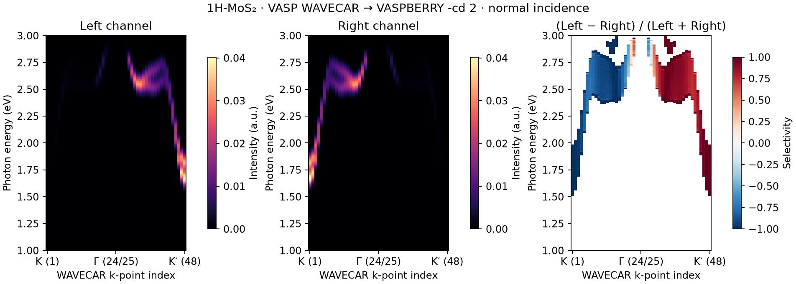

# Valley-selective optical transitions in monolayer MoS₂

Circularly polarized light couples differently to the K and K′ valleys of
monolayer MoS₂. This example calculates the two polarization channels along
K–Γ–K′ from the supplied spinor WAVECAR and illustrates their opposite
selectivity at the valley edges.



**Figure 1.** Left- and right-circular optical spectra at (a) K and (b) K′,
and (c) their normalized difference along K–Γ–K′. The horizontal scale of the
map uses cumulative Cartesian k distance. White regions have insufficient
intensity to form a meaningful ratio. Normal incidence, Gaussian broadening
0.05 eV, occupied bands 1–18 and final bands 19–20 are used. Intensities are in
arbitrary units. [PDF](reference/figure.pdf) · [Numerical data](reference/summary.csv).

## Calculation

Use the [MoS₂ band-path files](../../1H-MoS2/KPATH/2.band/): `WAVECAR`
contains 48 k points, 32 bands and both SOC spinor components, at a plane-wave
cutoff of 400 eV. The associated `POSCAR`, `INCAR`, `KPOINTS` and `EIGENVAL`
describe the structure, settings, path and band occupations.

From the repository root:

```bash
make serial
python3 -m pip install -r requirements-transport.txt
repo_dir="$PWD"
mkdir -p results/mos2-optical
(
  cd results/mos2-optical
  "$repo_dir/build/vaspberry-gfortran" \
    -f "$repo_dir/examples/1H-MoS2/KPATH/2.band/WAVECAR" \
    -s 2 -kx 48 -ky 1 -cd 2 -if 20 \
    -ien 1 -fen 3 -nediv 201 -sigma 0.05 \
    -theta 0 -phi 0 -o optical > stdout.log
)
python3 examples/features/circular-dichroism/run.py \
  --output-dir results/mos2-optical --postprocess-only
```

Here `-cd 2` sums transitions from occupied states, `-if 20` includes the
first two empty bands, and `-theta 0 -phi 0` specifies incidence along z.
`-s 2` reads a two-component spinor; it is not a conductivity multiplicity.
The photon-energy range is 1–3 eV with 201 samples. The 48 stored path points
are selected by `-kx 48 -ky 1`; these options do not generate new k points.

To run the calculation and plotting together in a fresh directory:

```bash
python3 examples/features/circular-dichroism/run.py --output-dir results/mos2-optical-auto
```

## Results and interpretation

The polarization selectivity is

```math
\eta=\frac{I_L-I_R}{I_L+I_R}.
```

The lowest K peak lies at about **1.67 eV**, with η = −1 in the program's
channel convention. K′ has the opposite selectivity, η = +1. The chosen
valence-to-conduction window demonstrates valley-selective transitions;
additional empty states are needed when extending the photon-energy range.

Files `CIRC_DICHROISM_W.optical_LEFT_KP1.dat` and `...RIGHT_KP1.dat` contain
the K spectra; point 48 corresponds to K′. The plotting step combines all
points into `summary.csv` and writes `figure.png` and `figure.pdf`.
The [original outputs](reference/raw-output.tar.gz) are also available.

The native spectra contain a factor of 1/Nk and photon-energy weighting.
Their intensity scale therefore depends on the sampling convention; the
common factor cancels in η. The calculation uses bare momentum matrix
elements of pseudo-wavefunctions. These k-resolved spectra describe optical
selection, rather than an absolute absorption coefficient. A path sum is
not a Brillouin-zone absorption integral.

## Optional PAW optical matrix route

The ordinary WAVECAR workflow above remains the simplest entry point. If a
standard VASP optical run is available, [`waveder-optics`](../../../docs/PAW_OPTICS.md)
calculates PAW circular transition strengths and spectra with physical length
units and complete initial/final degenerate groups. This optional route uses
unmodified VASP and offers CSV, DAT and NPZ output. Its normalization differs
from native `-cd 2`, so compare selection rules or match the conventions before
comparing intensities. Neither route predicts photoluminescence polarization.

## Other materials

Select the spinor setting, occupied/empty bands and photon-energy window from
your own VASP calculation. Check the transition intensity before interpreting
η, especially near forbidden transitions. Use a full integration mesh for
an integrated optical observable. The [synthetic angular-response reference](../../../validation/models/circular-dichroism/)
provides a supplementary check of polarization conventions.
