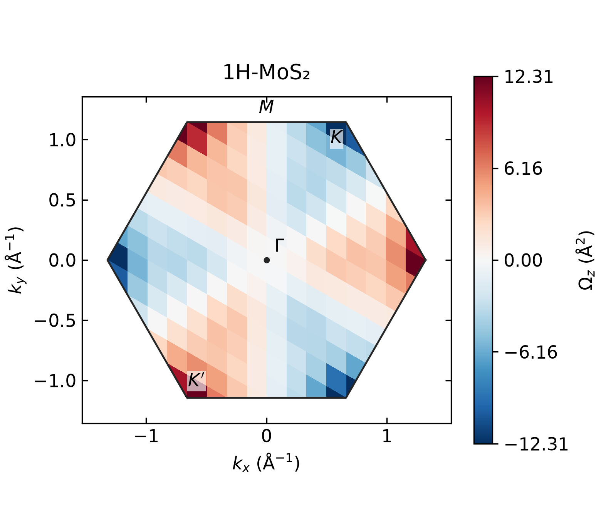

# MoS₂ Berry curvature over the first Brillouin zone

The occupied bands of monolayer 1H-MoS₂ have opposite Berry curvature near the
K and K′ valleys. Time-reversal symmetry makes the total Chern number vanish
even though the local curvature is finite. This example calculates the **Fukui
plaquette curvature Ωz(kx, ky)** from an actual VASP spinor WAVECAR and plots
it in Cartesian reciprocal coordinates inside the hexagonal first Brillouin zone.



The reference above was calculated with the current native VASPBERRY routine
from a newly generated, complete **12 × 12 × 1 VASP mesh**. The public structure
and SCF charge density provide the starting inputs. The generated 149 MB
WAVECAR is not bundled; the [VASP preparation instructions](inputs/README.md)
give the executed setup and commands to generate it with your licensed VASP
and PAW datasets. The supplied K–Γ–K′ WAVECAR is a line calculation and cannot
replace this two-dimensional mesh.

## Calculation and inputs

| Quantity | Reference calculation |
|---|---|
| System | Nonmagnetic monolayer 1H-MoS₂, SOC |
| VASP calculation | Fixed public SCF density, `ICHARG=11`, complete Γ-centered 12 × 12 × 1 mesh |
| Basis | 400 eV cutoff, 26 stored spinor bands, 144 k points |
| Selected subspace | Occupied bands 1–18 |
| Sampled occupied-to-empty gap | 1.67355 eV; the sampled global gap is also positive |
| Fukui sampling | 144 independent plaquettes |
| Input files | [POSCAR](inputs/POSCAR), [INCAR](inputs/INCAR), [KPOINTS](inputs/KPOINTS), public [CHGCAR.gz](../../1H-MoS2/KPATH/1.scf/CHGCAR.gz) |
| VASP reference output | [OUTCAR](reference/vasp/OUTCAR), [EIGENVAL](reference/vasp/EIGENVAL), [OSZICAR](reference/vasp/OSZICAR) |

The NSCF step took about 144 seconds and 602 MB peak resident memory on the
reference machine. The native Fukui step took about one minute. These timings
indicate the scale of this small example; they are not a convergence study.

## 1. Generate the full-mesh WAVECAR

From the repository root, prepare the working directory using the matching
licensed Mo/S PAW-PBE datasets:

```bash
python3 examples/features/fukui-berry-curvature/prepare_vasp.py \
  --potcar /path/to/licensed/Mo-S/POTCAR \
  --output-dir results/mos2-fullmesh-vasp

cd results/mos2-fullmesh-vasp
/path/to/vasp_ncl > vasp.stdout.log 2> vasp.stderr.log
cd ../..
```

The [input guide](inputs/README.md) describes the charge density, potential
specification, MPI launch option and expected convergence checks. Complete
this VASP calculation before the next step.

## 2. Run VASPBERRY

```bash
make serial
mkdir -p results/mos2-fukui-native
cd results/mos2-fukui-native
../../build/vaspberry-gfortran \
  -f ../mos2-fullmesh-vasp/WAVECAR \
  -s 2 -kx 12 -ky 12 -ii 1 -if 18 -o BERRYCURV \
  > vaspberry.log
cd ../..
```

`-s 2` reads both components of each SOC spinor. `-ii 1 -if 18` uses the
determinant of the occupied-subspace overlap matrix, allowing degeneracy
within that subspace. `-kx` and `-ky` describe the WAVECAR mesh; they do not
generate missing k points. This Fukui calculation does not use the Kubo
sum over empty intermediate states.

The sign convention is `phi = −Arg(product of link determinants)` around
`k → k+dk1 → k+dk1+dk2 → k+dk2 → k`. The reported curvature is
`Omega_z = phi / deltaS`, and the Chern number is `sum(phi)/(2*pi)`.
Since `deltaS` has units Å⁻², Ωz has units **Ų**.

## 3. Plot the Cartesian first Brillouin zone

```bash
python3 tools/plot_berry_curvature.py \
  --input results/mos2-fukui-native/BERRYCURV.dat \
  --poscar examples/features/fukui-berry-curvature/inputs/POSCAR \
  --output results/mos2-fukui-native/berry-curvature.png \
  --title '1H-MoS2'
```

The plot preserves each native plaquette value, tiles periodic copies, and
clips them to the reciprocal Wigner–Seitz cell. The axes are Cartesian kx and
ky in Å⁻¹ with equal geometric scale, and the color bar is centered on zero.
No interpolation introduces an apparently finer mesh. K denotes reciprocal
coordinates (1/3, 2/3), matching the material's K–Γ–K′ path; K′ is the opposite valley.

An optional runner performs steps 2 and 3, verifies the complete mesh, occupied
window and sampled gap, and checks the expected zero integral and
opposite-sign time-reversed curvature:

```bash
python3 examples/features/fukui-berry-curvature/run.py \
  --wavecar results/mos2-fullmesh-vasp/WAVECAR \
  --output-dir results/mos2-fukui
```

The runner writes both PNG and PDF figures, a numerical CSV and a machine-readable
result record. Its input is the VASP WAVECAR. JSON files record results and provenance.

## Reference results

| Output | Contents |
|---|---|
| [figure.png](reference/figure.png), [figure.pdf](reference/figure.pdf) | Cartesian first-BZ map shown above |
| [BERRYCURV.dat](reference/BERRYCURV.dat) | Current native Fukui output; only the workstation path in its comment header is normalized |
| [summary.csv](reference/summary.csv) | 144 unique plaquette centers, Ωz and flux; fractional centers use a centered primitive cell |
| [result.json](reference/result.json) | Input identity, numerical checks, units and plotting convention |
| [crosscheck.json](reference/crosscheck.json) | Independent production Python FHS comparison using the same actual WAVECAR |
| [vasp/run.json](reference/vasp/run.json) | VASP input/output identities, convergence and measured resources |

The plaquette area is **0.031470265 Å⁻²**. Curvature ranges from
**−12.3125 to +12.3124 Ų**. Integrating the four-decimal native printed values
gives **C ≈ −5.01 × 10⁻⁷**; the native calculation reports **0.0000**, and the
independent production Python FHS calculation gives **5.65 × 10⁻¹⁶**.
Time-reversed native plaquettes cancel to within **2 × 10⁻⁴ Ų**.
These residuals reflect numerical precision and the finite VASP convergence
threshold. The opposite valleys remain individually visible although their
total Chern number is zero.

The native file repeats the 144 plaquettes over a 3 × 3 display region.
Integrate **one** set of unique plaquettes. The runner deduplicates the
display copies before computing the integral.

The reference is a verified calculation at one mesh and cutoff. For
quantitative material predictions, converge the SCF density, cutoff and
k mesh; a 12 × 12 color map does not establish a converged valley peak.

### Historical comparison

The original public [BERRYCURV.dat](../../1H-MoS2/BERRYCURV.dat) is preserved.
Its separate [archived figure](reference/archive/figure.png) and
[reference record](reference/archive/result.json) have extrema ±12.233671 Ų
and a printed-value integral −4.01 × 10⁻⁸. The matching historical full-mesh
WAVECAR is unavailable. This older output and the new public-density NSCF
calculation show the same valley pattern; they are distinct calculations and
are not claimed to be bitwise reproductions of each other.

To replot that historical output without rerunning wavefunction overlaps:

```bash
python3 examples/features/fukui-berry-curvature/run.py \
  --archive-reference --output-dir results/mos2-fukui-archive
```

The historical file's `A^-2` curvature label is a typographical error; its
native `phi/deltaS` quantity has units Ų. Its numerical file is unchanged.

## Apply the workflow to another material

Supply its complete uniform mesh, matching POSCAR and appropriate spinor
setting. Select an isolated band or isolated group of bands, then change
the band indices and mesh dimensions in the native command. The optional
runner above checks this specific 12 × 12 MoS₂ reference; use the general
native CLI and plotting tool for other systems. Plot with the matching
POSCAR so the Cartesian Brillouin zone follows the actual reciprocal lattice.

For a supplied-WAVECAR calculation of a topological invariant, see the
[Bi occupied-subspace example](../fukui-chern/). For pointwise Kubo curvature
along a MoS₂ path, see the [Kubo example](../kubo-curvature/).
