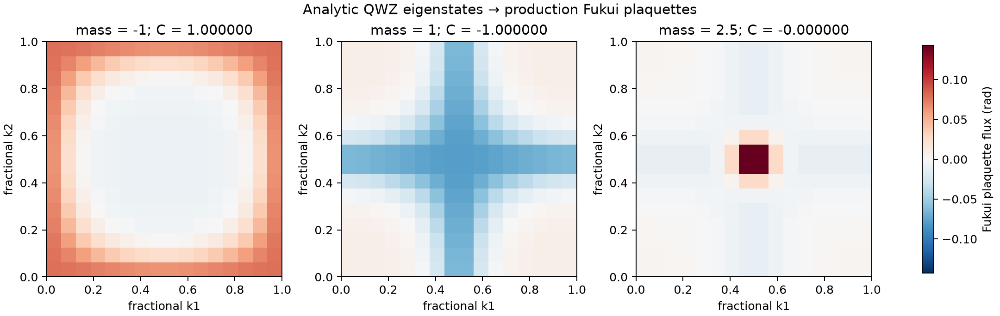

# Fukui plaquette Chern calculation

This example **recalculates** eigenstates of the public Qi–Wu–Zhang (QWZ)
two-orbital model and passes their links to the production Fukui plaquette
routine. It also evaluates the isolated lower band's T=0 Hall contribution
with the production four-vertex occupation integrator. No VASP calculation,
WAVECAR, Git LFS download, or proprietary input is needed.

## Inputs and command

From the repository root, with Python 3.10+:

```bash
python3 -m pip install -r requirements-transport.txt
python3 examples/features/fukui-chern/run.py \
  --output-dir results/feature-fukui-chern
```

The output directory must be new. The runner locates its input and Python
modules relative to itself, so it can also be called from another directory.
Use `--input PATH` to supply a copy of [input.json](input.json) with another
mesh or gapped model mass. Update its optional expected-Chern list when
changing masses. Masses -2, 0, and 2 are gap closings and are rejected.

The model is

`H(k) = sin(kx) σx + sin(ky) σy + [m + cos(kx) + cos(ky)] σz`,

with lattice constant 1 Å, energy scale 1 eV, a 16×16 periodic square mesh,
and the lower eigenstate (band 1). The three supplied masses are -1, +1,
and 2.5. The fixed convention is `A = i⟨u|∇k u⟩` and the loop has positive
`b1 × b2` orientation.

## Recalculated reference results

| Mass | Lower-band C | Lower-band σ at μ=0, T=0 (e²/h) |
|---:|---:|---:|
| -1 | +1 | -1 |
| +1 | -1 | +1 |
| 2.5 | 0 within 4×10⁻¹⁶ | 0 within 4×10⁻¹⁶ |

The empty-band reference gives zero contribution in each case. μ=0 fully
occupies the lower band and leaves the upper band empty in this model.
The current reference has minimum sampled gaps 2, 2, and 1 eV and minimum
link magnitudes at least 0.957. Numerical values are written without rounding
them to integers.



| Output | Meaning |
|---|---|
| `summary.csv` | Chern, expected phase, gaps, link quality, and two occupation limits |
| `plaquettes.csv` | Every calculated cell-center coordinate and flux in radians |
| `result.json` | Input, production functions, checksums, scope, and status |
| `figure.png` | Three calculated plaquette-flux maps |

The small checked-in [summary](reference/summary.csv),
[result record](reference/result.json), and [figure](reference/figure.png)
were generated by this runner. The [full plaquette table](reference/plaquettes.csv)
is also included for these three small cases. Last-bit floats and PNG encoding can depend on the numerical
and plotting environment; compare Chern/Hall values at 1e-10 tolerance.

## What this exercises

The runner independently diagonalizes the analytic Hamiltonian and builds
periodic nearest-neighbor overlaps. It then calls:

- `tools/wavecar_fukui.py::plaquette_flux`, including its phase sign and wrapping;
- `tools/vaspberry_transport.py::validate_fukui_geometry`, including grid,
  branch-margin and full-band Chern checks;
- `tools/vaspberry_transport.py::integrate_sigma`, using the four actual
  vertex energies and an isolated-band gap.

The states live in a complete orthonormal two-orbital model basis. This
example does **not** exercise the WAVECAR binary parser, plane-wave cutoff
matching, PAW augmentation, or a material's convergence. Its output is
cell-integrated flux in radians; it is not Kubo point curvature. A Fukui
integer on an unresolved material mesh alone is not a convergence proof.

For actual WAVECAR input and the geometric transport workflow, see
[VALLEY_TRANSPORT.md](../../../docs/VALLEY_TRANSPORT.md). For the model's
matrix/Kubo route, see [KUBO_TRANSPORT.md](../../../docs/KUBO_TRANSPORT.md).
