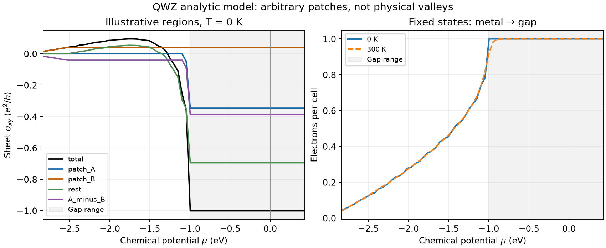

# Hall response and illustrative regional decomposition

Run from the repository root with Python, NumPy and Matplotlib:

```bash
python3 examples/features/hall-valley/run.py --output-dir results/example-hall
```

The directory must be new. [input.json](input.json) defines the QWZ model and
chemical-potential scan; [regions.json](regions.json) defines two disjoint
periodic circular patches. The runner calls the public `demo` → `matrix` →
`hall` CLI and imports the sibling
[QWZ example helper](../kubo-curvature/model_tools.py). No VASP files or
licensed data are needed.

## What this demonstrates

The two-band model has `m = -1`, a 1 Angstrom lattice constant, a 1 eV energy
coefficient, and spin multiplicity one. Its lower band ranges from −3 to −1 eV;
the gap is −1 to +1 eV. The fixed-state scan covers **−2.83 to +0.43 eV** at
0 and 300 K, moving from a partially occupied lower band into the gap. This
demonstrates a metallic occupation integral; it does not recompute the
Hamiltonian for self-consistent doping. At zero temperature `E = mu` is fully
occupied, matching the public integration convention.

Both bands and both intermediate states are included explicitly (`1:2`).
The highest-band occupation stays below the production cutoff guard
(reference maximum 2.66 × 10⁻¹⁰), so this run does not enable
`--allow-partial-bands`. A complete two-band analytic model is not a test of
DFT high-band convergence.

The user-defined circles have radius 1.2 Angstrom⁻¹ and centers `(0,0,0)`
and `(0.5,0.5,0)` in reciprocal fractional coordinates. The CLI adds `rest`
and `total`. `A_minus_B` is exactly `patch_A - patch_B`, without an implicit
factor of one-half. These are **illustrative masks, not uniquely defined
physical valleys or a conserved valley-current operator**. For a material,
choose and justify the regions for that system and check their sensitivity.

For `A = +i<u|d u>` and the ordered x/y plane,

```text
sigma_xy / (e^2/h) = -2*pi*mean_k sum_n f_n Omega_n
delta_sigma uses f(mu,T) - f(mu_reference,T); mu_reference = 0 eV
```

The gap reference is **−1 e²/h**, corresponding to lower-band Chern number
+1. `sigma_S` is sheet conductance in siemens, not bulk S/m. `band_id = 0`
labels the sum of represented bands; physical model bands are 1 and 2.
The standard full CSV includes each band and their sum.

## Checks and retained reference

The runner independently evaluates analytic QWZ energies and curvature,
Fermi occupations and square-cell periodic masks. It checks every output
row against direct quadrature, then checks:

- `patch_A + patch_B + rest = total`;
- the sum of band 1 and band 2 equals each `band_id = 0` row;
- `A_minus_B = patch_A - patch_B` for response and occupation columns;
- the zero-temperature gap response and one electron per cell;
- at least one zero-temperature sample with partial lower-band occupation.

The reference has 36 metallic zero-temperature samples, a maximum Hall
oracle error of 5.56 × 10⁻¹⁵ e²/h (including delta), and a maximum partition
sum residual of 7.78 × 10⁻¹⁵. Required absolute tolerances are 10⁻¹²; the
gap-integer quadrature tolerance is 10⁻⁷. These checks verify integration
and bookkeeping at this mesh. They do not establish metallic mesh convergence.

- [reference/result.json](reference/result.json): checks, units, region sizes,
  portable command provenance, version, base commit and source hashes.
- [reference/summary.csv](reference/summary.csv): compact selected-mu table,
  retaining all regional sum channels at both temperatures.
- [reference/figure.png](reference/figure.png): sheet response by patch and
  occupation across the metallic/gap scan.
- [reference/provenance.json](reference/provenance.json): reference file hashes.



A fresh run retains full `model/`, `curvature/` and `hall/` NPZ/CSV/JSON,
plus `result.json`, `summary.csv`, `figure.png`, subprocess stdout/stderr and
`run.json` with exit codes and hashes. The committed reference contains only
compact products. Compare numbers within tolerances, not byte-identical
archives or plots across environments. Local production provenance is kept
in the fresh run; the reference uses portable paths.

See the [Kubo transport guide](../../../docs/KUBO_TRANSPORT.md) and
[standalone CSV plotter](../../kubo/plot_hall.py) for other scan or plotting
choices. The patch sum can be reused for user-selected regions, but its
physical interpretation must come from the intended system.
