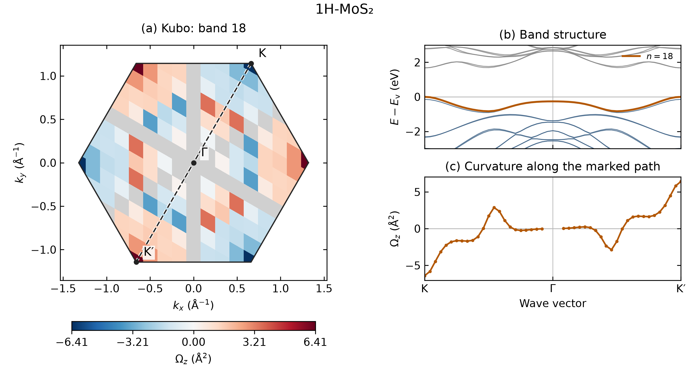

# MoS₂: Kubo curvature map, band structure and symmetry path

The figure shows the Berry curvature of the highest valence band of monolayer
1H-MoS₂ across the Brillouin zone and along **K–Γ–K′**. The dashed line on the
map identifies the path used in the band and curvature panels on the right.



**Figure.** (a) Band-18 Kubo curvature on a full 12×12 mesh in Cartesian
reciprocal coordinates. Each colored cell represents one k-point sample.
(b) Band structure on the marked path, with band 18 highlighted in orange;
energies are relative to the valence-band maximum. (c) Curvature calculated
directly at the 49 path points. Gray cells and gaps in the curve indicate
unresolved individual bands, with a nearest-band separation ≤10⁻⁵ eV.

## Method and inputs

For a nondegenerate band, VASPBERRY evaluates

$$
\Omega_{n,z}(\mathbf{k})=-2\,\mathrm{Im}
\sum_{m\ne n}\frac{D^x_{nm}(\mathbf{k})D^y_{mn}(\mathbf{k})}
{[E_n(\mathbf{k})-E_m(\mathbf{k})]^2},\qquad D^a=\hbar v_a.
$$

The native WAVECAR implementation uses the canonical-momentum approximation
$v_a=p_a/m_e$. Curvature is in Ų. PAW augmentation and nonlocal/SOC velocity
corrections are not included. The sum uses all stored intermediate bands.

| Setting | BZ map and matching path |
|---|---|
| VASP input | Two SOC WAVECARs: full mesh and band path |
| Electronic structure | Same public SCF density, structure, potentials, 400 eV cutoff and 26 bands |
| BZ sampling | Full Γ-centered 12×12×1 mesh |
| Path sampling | 49 points K–Γ–K′, Γ included once at index 25 |
| Reciprocal path vertices | K = (1/3, 2/3, 0), Γ = (0, 0, 0), K′ = −K |
| Selected output bands | 17 and 18; the figure displays band 18 |
| Intermediate states | Bands 1–26 in both calculations |
| Occupied-to-empty gap | Approximately 1.674 eV |

The [full-mesh preparation](../fukui-berry-curvature/inputs/README.md) uses
the public MoS₂ SCF charge density. The [matching path preparation](../fukui-berry-curvature/inputs/path/README.md)
copies that setup and changes only the k-point list. Use those instructions
to generate `results/mos2-fullmesh-vasp/WAVECAR` and
`results/mos2-path-vasp/WAVECAR` with your licensed VASP and PAW datasets.
The same mesh WAVECAR supplies the [Fukui example](../fukui-berry-curvature/).

## Calculate and plot

From the repository root:

```bash
make serial
python3 -m pip install -r requirements-transport.txt
python3 examples/features/kubo-curvature/run_fullmesh.py \
  --wavecar results/mos2-fullmesh-vasp/WAVECAR \
  --path-wavecar results/mos2-path-vasp/WAVECAR \
  --output-dir results/mos2-kubo-panels
```

The runner executes VASPBERRY for each WAVECAR, checks the mesh and path,
exports the unchanged VASP energies, and writes PNG/PDF figures and CSV data.
It takes about four seconds for these prepared inputs on the reference machine.

The native command used in each calculation directory is:

```bash
/path/to/vaspberry-gfortran \
  -f /path/to/WAVECAR -s 2 -kubo 2 -ii 17 -if 18 \
  -kubo_csv KUBO.csv -o BERRYCURV > vaspberry.log
```

Run it once with the mesh WAVECAR and once with the matching path WAVECAR,
in separate output directories. `-kubo 2` evaluates the actual k points
stored in WAVECAR; it does not create a new mesh. For MPI, use `make mpi`
and prefix the MPI executable with `mpiexec -n 2`.

## Redraw the supplied results

The figures can be reproduced from the distributed numerical outputs without
rerunning VASP or VASPBERRY:

```bash
python3 tools/plot_berry_panels.py \
  --method kubo \
  --input examples/features/kubo-curvature/reference/map-path/KUBO_mesh.csv \
  --path-input examples/features/kubo-curvature/reference/map-path/KUBO_path.csv \
  --bands-csv examples/features/kubo-curvature/reference/map-path/bands.csv \
  --poscar examples/features/fukui-berry-curvature/inputs/POSCAR \
  --band 18 --path-node-indices 1 25 49 --path-labels K Gamma Kprime \
  --title '1H-MoS2' --output results/mos2-kubo-replot.png
```

For a new calculation, `--path-wavecar` can replace `--bands-csv` to read
VASP energies directly. The general plotter also accepts other bands, path
node indices, labels and structures. Use PDF as the output suffix for a
vector figure. CSV energies retain their original VASP zero; the shift to
the valence-band maximum is applied only in the figure.

## Reference results

| Quantity | Band 18 |
|---|---:|
| Ωz(K), full mesh | −6.41478 Ų |
| Ωz(K′), full mesh | +6.41477 Ų |
| Ωz(K), matching path | −6.41480 Ų |
| Ωz(K′), matching path | +6.41485 Ų |
| Resolved points | 110/144 on the mesh; 46/49 on the path |

[Panel PNG](reference/map-path/figure.png) · [PDF](reference/map-path/figure.pdf) ·
[Full-mesh Kubo CSV](reference/map-path/KUBO_mesh.csv) ·
[Path Kubo CSV](reference/map-path/KUBO_path.csv) ·
[Band energies](reference/map-path/bands.csv) ·
[Plotted path curve](reference/map-path/path_curvature.csv) ·
[Calculation record](reference/map-path/result.json)

The bands and curvature share cumulative Cartesian path distance,
$s_j=\sum_{i<j}|\mathbf{k}_{i+1}-\mathbf{k}_i|$, with reciprocal vectors
containing 2π. Each K–Γ segment is approximately 1.320704 Å⁻¹.
The finite cells in the map visualize pointwise Kubo samples; they are not
Fukui plaquette averages. The line uses an actual path calculation rather
than interpolation of the map.

The [Fukui figure](../fukui-berry-curvature/reference/map-path/figure.png)
shows the complete occupied group, bands 1–18. Its amplitude is therefore
a different quantity from the single-band Kubo curvature here. Near band
degeneracies, use a suitable subspace treatment; do not interpret unstable
individual-band denominators as physical peaks. Converge both k sampling
and NBANDS before drawing quantitative conclusions.

## Supplied 32-band path example

The original downloadable [48-point WAVECAR](../../1H-MoS2/KPATH/2.band/WAVECAR)
and its 32-band Kubo calculation remain available:

```bash
python3 examples/features/kubo-curvature/run.py \
  --wavecar examples/1H-MoS2/KPATH/2.band/WAVECAR \
  --output-dir results/mos2-kubo-supplied-path
```

[Original path figure](reference/figure.png) · [PDF](reference/figure.pdf) ·
[Summary](reference/summary.csv) · [Native Kubo CSV](reference/KUBO.csv).
It gives band-18 valley values about ±6.67 Ų with intermediate bands 1–32.
That stored result is separate from the matched 26-band map/path shown above.
A band path alone cannot determine a Brillouin-zone Chern number or Hall
conductivity; see the [Bi Hall example](../hall-valley/) for a full occupied-space integral.
