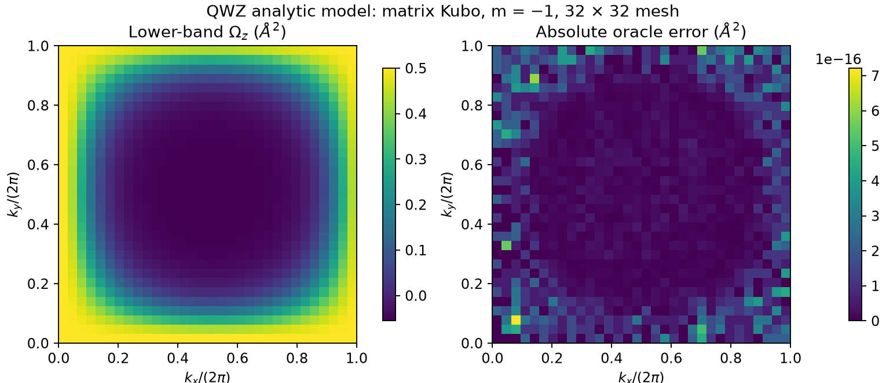

# Kubo curvature: public analytic-model check

Run from the repository root with Python, NumPy and Matplotlib:

```bash
python3 examples/features/kubo-curvature/run.py --output-dir results/example-kubo
```

The output directory must be new. The runner reads [input.json](input.json),
calls the public `vaspberry_kubo.py demo` and `matrix` commands, and compares
every curvature value with an independent closed-form expression. No VASP
files, executable or licensed data are needed. The sibling Hall example also
uses this folder's small [model_tools.py](model_tools.py) helper.

## Model, sign and checks

The QWZ Hamiltonian is

```text
H = sin(kx) sigma_x + sin(ky) sigma_y + (m + cos(kx) + cos(ky)) sigma_z
m = -1; lattice constant = 1 Angstrom; energy coefficient = 1 eV
```

With `A = +i<u|d u>` and ordered axes `(kx, ky)`, the analytic lower-band
curvature is

```text
Omega_lower = [cos(kx) + cos(ky) + m cos(kx) cos(ky)] / (2 |d|^3)
Omega_upper = -Omega_lower
```

`Omega` has units Angstrom². The continuum band Chern numbers are **+1, −1**;
the runner integrates the actual point curvature without integer rounding.
Both the output and intermediate windows are explicitly `1:2`: the full
two-band model. This exact model window does not establish convergence of
an intermediate-band cutoff in a DFT calculation. Spin multiplicity is one.

On the default 32 × 32 mesh, the retained reference has:

| Check | Reference | Required tolerance |
|---|---:|---:|
| Maximum pointwise oracle error | 7.22 × 10⁻¹⁶ Angstrom² | < 10⁻¹² Angstrom² |
| Maximum `Omega_lower + Omega_upper` magnitude | 1.67 × 10⁻¹⁶ Angstrom² | < 10⁻¹² Angstrom² |
| Sampled lower-band Chern number | 1.0000000009382 | distance from +1 < 10⁻⁷ |
| Minimum isolation gap | 2 eV | positive; every state valid |

The runner also checks the analytic energies and unchanged source hashes.
This is a normalization, sign and implementation example for an analytic
model, not a material benchmark or a general mesh-convergence certificate.

## Inspect and reproduce

- [reference/result.json](reference/result.json): numerical checks, units,
  portable commands, version, base commit and source hashes.
- [reference/summary.csv](reference/summary.csv): both bands at 16 selected
  k points, with analytic curvature and residuals. Every mesh point is checked
  during execution.
- [reference/figure.png](reference/figure.png): lower-band curvature and
  absolute oracle error.
- [reference/provenance.json](reference/provenance.json): reference file hashes.



The fresh run keeps complete generated data in `model/` and `curvature/`,
including NPZ/CSV/JSON products. It also writes `result.json`, `summary.csv`,
`figure.png`, subprocess stdout/stderr and `run.json` with command exit codes
and hashes. Large generated NPZ files are deliberately absent from the
committed reference. Compare numerical checks within the stated tolerances;
archive hashes describe the original run, not a promise of byte-identical
NPZ files or plots across software versions. Production metadata may record
the local output path; the committed result uses portable path placeholders.

See [Kubo transport](../../../docs/KUBO_TRANSPORT.md) for applying the
same standardized matrix and curvature workflow to another Hamiltonian.
