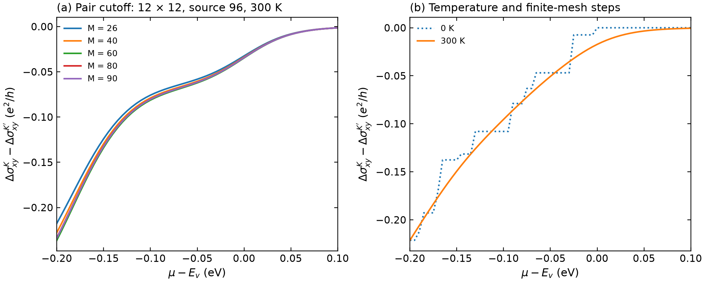

# MoS₂: intrinsic charge and regional valley Hall response

This example starts from an actual VASP spinor `WAVECAR`. The native Fortran program
exports interband matrix-element pairs directly from those wavefunctions.
The bundled Python integration tool applies occupations and integrates the
Kubo response while scanning the chemical potential. No Wannierization is needed. The calculation uses the
same monolayer 1H-MoS₂ structure and fixed SCF density as the
[Berry-curvature example](../fukui-berry-curvature/README.md).

The ordinary WAVECAR workflow below requires no VASP source modification.
The separate [matched operator comparison](operator-comparison/README.md)
shows how optional full PAW velocity matrices change the response on the
same electronic states, with additional producer instructions kept there.


**Figure.** (a) Cartesian first Brillouin zone and periodic disks of radius
0.35 Å⁻¹ around K and K′; the remaining area is `rest`. (b) The independently
calculated 26-band K–Γ–K′ path for the same structure, 400 eV cutoff and SCF
density; this band plot is an energy reference, not the integration mesh.
(c) Regional charge Hall changes at 300 K.
(d) k-mesh refinement with 60 stored bands and fixed pair cutoff `M=40`. Each calculation uses its own
valence-band maximum (E_v) to align the horizontal axis.

Here **Δσ(μ) = σ(μ) − σ(μref)**, with μref at the middle of the global band gap.
The valley difference is **ΔσK − ΔσK′**, with no factor of one half. Time-reversal
symmetry makes the total charge Hall response vanish; the opposite regional
responses remain visible. These spatially partitioned charge responses depend
on the specified regions and are not a calculation of a separately defined
conserved valley-current operator.

## 1. Prepare and run VASP

From the repository root, use Python with NumPy and Matplotlib, and a built
native VASPBERRY executable. The [build instructions](../../../README.md)
cover serial and MPI builds.

```bash
python3 examples/features/kubo-hall/prepare_vasp.py \
  --potcar /path/to/licensed/Mo-S/POTCAR \
  --mesh 24 --nbands 60 --output-dir results/mos2-24-b60-vasp

cd results/mos2-24-b60-vasp
vasp_ncl > stdout.log 2> stderr.log
cd ../..
```

The preparation script writes ordinary `INCAR`, `POSCAR`, `KPOINTS`, `CHGCAR`
and licensed `POTCAR` files. It reuses the public
[SCF charge density](../../1H-MoS2/KPATH/1.scf/CHGCAR.gz),
[structure](../fukui-berry-curvature/inputs/POSCAR) and
[NSCF settings](../fukui-berry-curvature/inputs/INCAR), setting `NBANDS`, the complete Γ-centered k mesh, `EDIFF=1e-8` and
`NELMIN=16`. Extra stored empty bands and explicit iteration checks are needed
because occupied-energy convergence alone can leave the highest empty states
inaccurate. This command starts from scratch; the reference conditions also record
the warm restarts used for the published calculations. The matching
[PAW dataset specification](../../1H-MoS2/PSEUDOPOTENTIAL.md) identifies the
required Mo/S datasets. `POTCAR` and newly generated `WAVECAR` files are not
distributed here.

Confirm that VASP reached `EDIFF` and ended normally before using its output.
The setup is SOC, `ICHARG=11`, `ISYM=-1`, 400 eV, with 18 occupied spinor bands.
Use a complete two-dimensional mesh; the supplied line-path `WAVECAR` cannot
replace it.

## Shortcut: calculate the Hall table, then draw the curves

Once the full-mesh VASP calculation is complete, the general `wavecar-hall`
command runs native Fortran, validates its pair output and integrates the Hall
scan. Python is the launcher and postprocessor; the wavefunction matrix
calculation still runs in the Fortran executable. The first calculation needs
one numerical command and one plot command.

Choose the build once. For GNU serial:

```bash
make serial
binary=build/vaspberry
ranks=1
```

For Intel MPI, load the site's oneAPI/Intel MPI/oneMKL environment and use
`make ifx-mpi`, `binary=build/vaspberry-ifx-mpi`, `ranks=4` instead. The GNU MPI
choice is `make mpi`, `binary=build/vaspberry-mpi`, `ranks=4`. Use the matching
`mpiexec` on `PATH`; see [compiler and MPI setup](../../../docs/BUILD.md).
Do not start the Python command with `mpiexec`: `--mpi-procs` launches only
the native calculation on that many ranks.

```bash
python3 tools/vaspberry_kubo.py wavecar-hall \
  --binary "$binary" --mpi-procs "$ranks" --mpi-launcher mpiexec \
  --wavecar results/mos2-24-b60-vasp/WAVECAR \
  --spinor-components 2 --spin-multiplicity 1 --mesh 24 24 \
  --energy-reference 'unchanged VASP eigenvalue zero' --pair-band-max 40 \
  --mu-min -1.47487388 --mu-max -1.17487388 --mu-num 61 \
  --mu-reference -0.43809870 --temperatures 0 300 \
  --regions examples/features/kubo-hall/regions.json --difference valley:K:Kprime \
  --degeneracy-policy coalesce --degeneracy-threshold-eV 1e-7 \
  --output-dir results/mos2-24-wrapped

python3 tools/plot_hall.py results/mos2-24-wrapped/hall/conductivity.csv \
  --regions total K Kprime valley --temperatures 300 \
  --quantity delta-sigma --energy-origin-eV -1.27487388 \
  --energy-label 'mu - Ev (eV)' --output-dir results/mos2-24-wrapped-plot
```

The numerical command writes the following inside `results/mos2-24-wrapped/`:

| Output | Contents |
|---|---|
| `native/PAIRS.csv`, `native/stdout.log`, `native/stderr.log` | Raw Fortran interband numerators and its execution logs |
| `pairs/pairs.npz`, `pairs/pairs.json` | Reusable source energies, k mesh, lattice and matrix products |
| `hall/conductivity.csv`, `.dat`, `.npz`, `.json` | 610 rows: 61 μ × 2 T × 5 regions, with σ, Δσ, carriers and metadata |
| `workflow.json` | Native command, source/binary hashes and completion status |

The plot command creates `hall.png`, `hall.pdf`, `hall.svg` and `plot.json` in
`results/mos2-24-wrapped-plot/`. It draws total, K, K′ and K−K′ **Δσ at 300 K**
against μ−Ev. These are conductivity curves; k-space maps and band plots use
their own data and commands. All energy values here are specific to this MoS₂
reference. Both output directories must be new.

For another temperature, reuse the saved pairs:

```bash
python3 tools/vaspberry_kubo.py pair-hall \
  --pairs-dir results/mos2-24-wrapped/pairs --pair-band-max 40 \
  --mu-min -1.47487388 --mu-max -1.17487388 --mu-num 61 \
  --mu-reference -0.43809870 --temperatures 100 \
  --regions examples/features/kubo-hall/regions.json --difference valley:K:Kprime \
  --degeneracy-policy coalesce --degeneracy-threshold-eV 1e-7 \
  --output-dir results/mos2-24-100K
```

No WAVECAR or Fortran calculation is repeated in this scan. Plot
`results/mos2-24-100K/conductivity.csv` with `--temperatures 100` to show the new
curves. For explicit control over the raw Fortran export and import, follow
[step2](#2-export-matrix-element-pairs-with-native-fortran) and step3 below.

## 2. Export matrix-element pairs with native Fortran

```bash
make serial
repo_dir="$PWD"
mkdir -p results/mos2-24-native
(
  cd results/mos2-24-native
  "$repo_dir/build/vaspberry" \
    --wavecar "$repo_dir/results/mos2-24-b60-vasp/WAVECAR" \
    --spinor 2 --task kubo-pairs --pairs-csv PAIRS.csv > vaspberry.log
)
```

`PAIRS.csv` contains every stored band pair and all three Cartesian
antisymmetric matrix products. This is the wavefunction calculation.
Pair export uses all stored bands; omit `--bands` in this mode. For MPI, build with
`make mpi` and use `mpiexec -n 4 "$repo_dir/build/vaspberry-mpi"`.

## 3. Integrate occupations and plot

First validate the exported coordinates, energies and pair coverage against
the same WAVECAR and save a reusable pair cache:

```bash
python3 -m pip install -r requirements-transport.txt
python3 tools/vaspberry_kubo.py import-pairs \
  --csv results/mos2-24-native/PAIRS.csv \
  --wavecar results/mos2-24-b60-vasp/WAVECAR \
  --spinor-components 2 --spin-multiplicity 1 --mesh 24 24 \
  --energy-reference 'unchanged VASP eigenvalue zero' \
  --output-dir results/mos2-24-pairs

python3 tools/vaspberry_kubo.py pair-hall \
  --pairs-dir results/mos2-24-pairs --pair-band-max 40 \
  --mu-min -1.47487388 --mu-max -1.17487388 --mu-num 61 \
  --mu-reference -0.43809870 --temperatures 0 300 \
  --regions examples/features/kubo-hall/regions.json \
  --difference valley:K:Kprime \
  --degeneracy-policy coalesce --degeneracy-threshold-eV 1e-7 \
  --formats csv dat npz --output-dir results/mos2-24-hall

python3 tools/plot_hall.py results/mos2-24-hall/conductivity.csv \
  --regions total K Kprime valley --temperatures 300 \
  --quantity delta-sigma --energy-origin-eV -1.27487388 \
  --energy-label 'μ − Ev (eV)' --output-dir results/mos2-24-hall-plot
```

The energies above belong to this reference: Ev ≈ −1.27487388 eV and the
midgap reference μref ≈ −0.43809870 eV, using unchanged VASP eigenvalues.
Check them against your completed VASP result. For another system or energy
zero, replace the range and reference. The scan contains 61 chemical
potentials from Ev − 0.20 to Ev + 0.10 eV at 0 and 300 K.

`pair-hall` performs Fermi occupation weighting and Brillouin-zone integration;
it is **numerical postprocessing**, not just plotting. Changing μ or T can
reuse `results/mos2-24-pairs` without rereading WAVECAR or rerunning the native
matrix-element calculation. `plot_hall.py` only reads the completed tables.
The [region file](regions.json) defines optional K/K′ integration disks;
`rest` closes the partition. JSON records this geometry, not electronic structure.

| Output | Use |
|---|---|
| `mos2-24-native/PAIRS.csv` | Native interband pair numerators |
| `mos2-24-pairs/pairs.npz` and `pairs.json` | Reusable validated pair data |
| `mos2-24-hall/conductivity.csv`, `.dat`, `.npz` | Equivalent numerical Hall tables |
| `mos2-24-hall/conductivity.json` | Units, sign, regions, operator and degeneracy diagnostics |
| `mos2-24-hall-plot/hall.png`, `.pdf`, `.svg` | The 300 K regional curves relative to Ev |

All paths in the table are under `results/`. The Hall tables include
**absolute σ and Δσ**, `total`, `K`, `Kprime`, `rest` and `valley`, plus carrier
counts. Conductivity is a two-dimensional sheet response in e²/h and siemens;
no slab thickness is applied. Check the regional sum and the unhalved
K − K′ difference, along with total-charge cancellation.

The published composite figures use several mesh and band-window runs.
They can be redrawn from the compact references with [plot.py](plot.py),
using the command in [reference/README.md](reference/README.md).

### Optional reproduction helper

This MoS₂-specific command combines native pair export, integration, checks
and plots. It locates Ev and the band-18 gap from the supplied WAVECAR:

```bash
python3 examples/features/kubo-hall/run.py \
  --wavecar results/mos2-24-b60-vasp/WAVECAR \
  --binary build/vaspberry \
  --mesh 24 --pair-band-max 40 --output-dir results/mos2-24-checked
```

The general `wavecar-hall` shortcut above combines native export and numerical
integration; `plot_hall.py` reads the resulting table separately. See the
[Kubo/Hall guide](../../../docs/KUBO_TRANSPORT.md) for the full output mapping.
The explicit native and integration commands expose each output for reuse
with another material.

## 4. Check k sampling and the intermediate-band window

`NBANDS` is the number of states stored by VASP. `--pair-band-max M` restricts
the pair sum to bands 1–M while retaining the actual source-band count in the
metadata. Storing additional states above M helps converge the states used in
the sum. The example uses **60 stored bands with M=40** for mesh refinement;
its cutoff study uses several values of M within one 96-band source.

The k mesh controls integration resolution. The reference compares the 300 K
valley-change curves on a common μ − Ev grid, reporting the maximum absolute
change and relative L2 norm of each refinement. A 1% relative-L2 threshold
is used to describe these comparisons. The 0 K finite-mesh steps are retained.
The final source-band counts, retained cutoffs and measured residuals are
listed in [reference/README.md](reference/README.md); increasing a cutoff to
the highest stored band does not by itself establish convergence.



An input sanity check was decisive here: a loose occupied-energy stopping
criterion left the highest empty states at k and −k with different energies.
Using a converged lower pair window inside a larger WAVECAR restored the
expected total-charge cancellation. The complete source export is kept in
the cache, and the retained window is always reported explicitly. No response
is forced to zero or averaged with its time-reversed counterpart. VASP
[documents the slower convergence of the highest iteratively calculated states](https://vasp.at/wiki/NBANDS).

This is a rigid-band intrinsic response: changing μ changes occupations, not
the self-consistent potential. The present native operator uses canonical
momentum without PAW, nonlocal or SOC velocity corrections. Increasing the
mesh or `NBANDS` tests numerical convergence of that operator and does not
remove those operator approximations. Numerical energy groups within
10⁻⁷ eV are explicitly coalesced for the pair integration; unchanged input
energies and the resulting energy/occupation shifts are recorded. A 10⁻⁶ eV
sensitivity check accompanies the reference.
