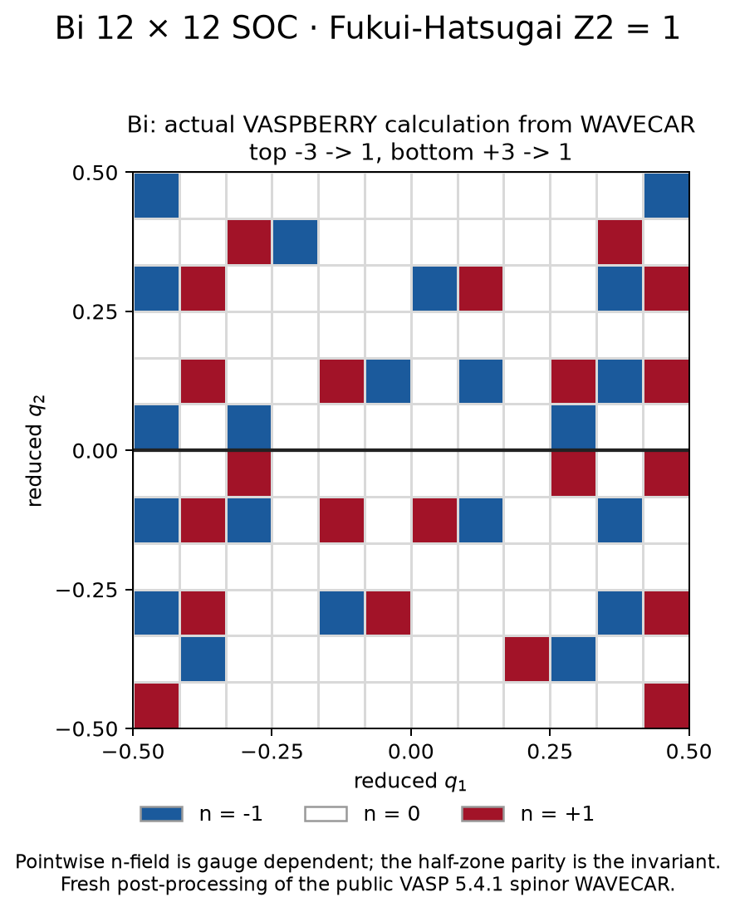

# Fukui–Hatsugai Z₂ from a real Bi WAVECAR

**Start with the public VASP SOC WAVECAR, run VASPBERRY, and obtain Z₂ = 1.**
This tutorial recalculates the wavefunction overlaps and n-field with the
current Fortran executable; it does not merely redraw a stored field.

## 1. Obtain the actual VASP output

Run these commands from the repository root. The calculation input is the
**real Bi `WAVECAR`**, not a JSON configuration or model Hamiltonian.

```bash
git lfs pull --include='examples/Bi_Z2/WAVECAR'
shasum -a 256 examples/Bi_Z2/WAVECAR
```

Expected SHA-256:

```text
a8d81854f2efc561938e478dde1be29a17ccc95d5d37325c122b9d9e82fa0838
```

The payload is **200,421,600 bytes**. A 134-byte Git LFS pointer is not a usable
WAVECAR. If Git LFS is unavailable, download the same public file separately:

```bash
mkdir -p inputs
curl -fL https://media.githubusercontent.com/media/Infant83/VASPBERRY/a692e21482d24767859d02b7885dd70b234c6a2c/examples/Bi_Z2/WAVECAR -o inputs/Bi-WAVECAR
shasum -a 256 inputs/Bi-WAVECAR
```

Then pass `--wavecar inputs/Bi-WAVECAR` to the runner below. It verifies the
exact size and checksum before executing VASPBERRY. It never substitutes a
model or a stored result for a missing input.

### Input files and provenance

| File | Role |
|---|---|
| [`Bi_Z2/WAVECAR`](../../Bi_Z2/WAVECAR) | Actual VASPBERRY input: 144 points on a 12 × 12 × 1 mesh, 18 SOC spinor bands |
| [`archive-2016-run/EIGENVAL`](../../Bi_Z2/archive-2016-run/EIGENVAL) | VASP band energies, cross-checked against WAVECAR by the runner |
| [`archive-2016-run/OUTCAR`](../../Bi_Z2/archive-2016-run/OUTCAR) | Archived VASP 5.4.1 settings and output |
| [`inputs/POSCAR`](../../Bi_Z2/inputs/POSCAR) | Bi structure for a new calculation |
| [`inputs/01_scf/`](../../Bi_Z2/inputs/01_scf/) and [`inputs/02_z2_nscf/`](../../Bi_Z2/inputs/02_z2_nscf/) | Recommended SCF and full-mesh SOC input templates |
| [`PSEUDOPOTENTIAL.md`](../../Bi_Z2/PSEUDOPOTENTIAL.md) | Potential provenance; licensed POTCAR is not redistributed |

The archived WAVECAR came from a 2016 fixed-charge calculation. The full
preceding SCF provenance is unavailable. This tutorial reproduces **VASPBERRY
post-processing of that public VASP result**. The recommended VASP input
templates are not claimed to recreate every digit of the 2016 WAVECAR.

## 2. Build VASPBERRY and plotting dependencies

```bash
make serial
python3 -m pip install -r requirements-transport.txt
```

## 3. Run the actual calculation and make the figure

```bash
python3 examples/features/z2/run.py --output-dir results/bi-z2
```

The wrapper verifies the input, invokes VASPBERRY, validates the new CSV and
plots its integer n-field. Inside a new output directory it runs this native
command, where `WAVECAR` points to the downloaded public input:

```bash
/path/to/vaspberry/build/vaspberry-gfortran \
  -f WAVECAR -o NFIELD -z2 1 \
  -kx 12 -ky 12 -s 2 -ii 1 -if 10 > fortran.log 2>&1
```

Here `-z2 1` selects the Fukui–Hatsugai n-field calculation, `-s 2` selects
SOC spinors, and bands 1–10 form the complete occupied subspace.
`-kx 12 -ky 12` describes the full mesh already present in WAVECAR.

The existing material runner is another entry point:
`VASPBERRY_BIN="$PWD/build/vaspberry-gfortran" ./examples/Bi_Z2/scripts/run_z2.sh`.
For MPI, build with `make mpi` and run the native command with
`mpiexec -n 4 /path/to/vaspberry/build/vaspberry-mpi`. The convenience Python
runner uses serial execution.

## 4. Compare your outputs

| Produced file | Stored reference | What it contains |
|---|---|---|
| `Z2_FIELD.csv` | [Full-precision field](reference/Z2_FIELD.csv) | Fresh schema-2 field, invariant and numerical diagnostics |
| `NFIELD.dat` | [Native n-field output](reference/NFIELD.dat) | Legacy plotting output |
| `fortran.log` | [Native log](reference/fortran.log) | Actual VASPBERRY execution |
| `band_edges.csv` | [Band edges](reference/band_edges.csv) | VASP bands 10/11 and their separation |
| `summary.csv` | [Summary](reference/summary.csv) | Parities, sums, numerical residuals and sampled gaps |
| `figure.png` | [Reference figure](reference/figure.png) | Integer n-field calculated from the actual WAVECAR |
| `result.json` | [Run provenance](reference/result.json) | PASS, input/source/output hashes and exact command |



Expected result:

```text
result_status=PASS
reportable_invariant=1
z2_invariant=1
half_top_nfield_sum=-3       -> parity 1
half_bottom_nfield_sum=3     -> parity 1
half_bz_parity_consistent=1
```

The WAVECAR minimum occupied/empty direct gap is **0.592448500 eV** and the
sampled global gap is **0.510044362 eV**. Subtracting the individually rounded
energies in EIGENVAL gives 0.592449 and 0.510045 eV respectively. The minimum link
singular value is about **0.815455**. Total Chern and wrapped TR-odd flux
residuals are near machine precision; their final digits may change with
the compiler or numerical libraries. Consult the full-precision CSV and the
[Z₂ result contract](../../../docs/Z2_FUKUI_HATSUGAI.md) for thresholds.
The pointwise n-field depends on gauge and logarithm branch; the agreed
half-zone parity determines Z₂. It is not a local measurable curvature map.

The committed reference is a fresh current-version calculation from the
checked public WAVECAR. It agrees with the older
[material reference](../../Bi_Z2/reference-v1.2.0-12x12/), which is preserved.

## 5. Apply the commands to your system

1. Establish a nonmagnetic, time-reversal-symmetric insulating state in VASP.
   Produce the full even 2D SOC mesh with `ISYM=-1`; use the supplied
   [SCF/NSCF templates](../../Bi_Z2/inputs/) as a starting point.
2. Check the actual WAVECAR mesh and select a **fixed, even-dimensional
   occupied bundle** separated from all unoccupied bands over the mesh.
3. Replace the input path, mesh and occupied range in the native command.
   The tutorial runner verifies the exact Bi fixture; it intentionally does
   not reinterpret arbitrary materials using Bi's band indices.
4. Require `result_status=PASS`, a reportable invariant and agreement of the
   two complementary half-zone parities. Inspect the gap and diagnostics on
   denser meshes before drawing a material conclusion.

PASS checks the numerical consistency of VASPBERRY's TR reconstruction; it
does not independently establish physical TR symmetry, PAW completeness, or
k-mesh convergence. WAVECAR pseudo-wavefunction overlaps omit PAW
augmentation. See [method and validity requirements](../../../docs/Z2_FUKUI_HATSUGAI.md).
