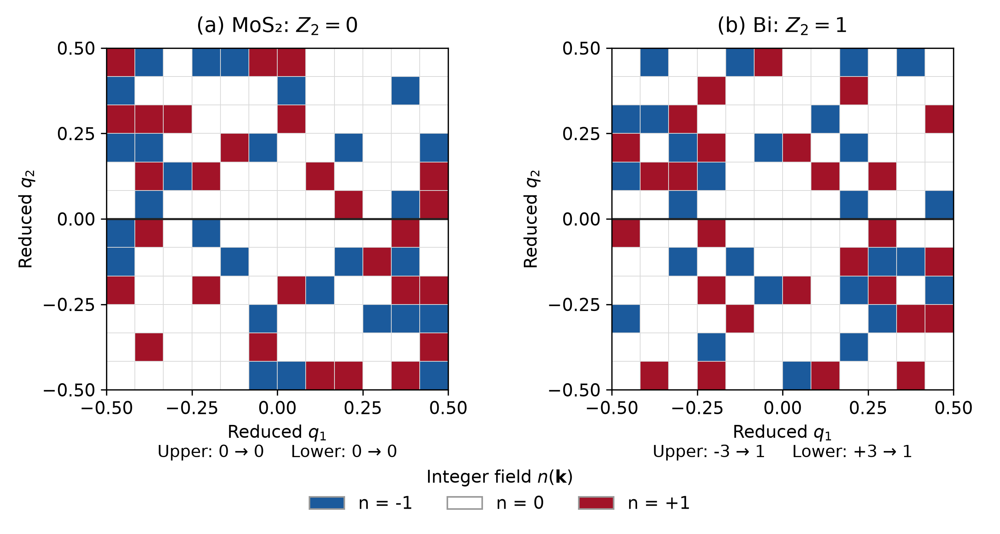

# MoS₂ and Bi: Z₂ = 0 and Z₂ = 1

The same native Fukui–Hatsugai procedure gives **Z₂ = 0** for monolayer
1H-MoS₂ and **Z₂ = 1** for the buckled Bi bilayer. Both use full Γ-centered
12×12 meshes and complete occupied SOC bundles. The Bi result is the fresh
PBE+SOC calculation used in the technical report, separate from the older
archived Bi tutorial.



| Input | Occupied bands | Upper / lower integer sums | Z₂ |
|---|---|---|---:|
| MoS₂ | 1–18 | 0 / 0 | **0** |
| Bi | 1–10 | −3 / +3 | **1** |

The solid line is q₂ = 0. The arrows below each panel show the half-zone
sum followed by its parity. Native integer tiles are displayed directly on
the reduced mesh; no interpolation is applied. The local n-field is gauge
and branch dependent, not an observable Berry-curvature map.

## Calculate the two native fields

- [MoS₂ preparation and native command](../mos2/) reuse the existing
  full-mesh curvature input, with occupied bands 1–18.
- [Fresh Bi preparation and native Z₂ calculation](../../../materials/bi-spin-hall/)
  use occupied bands 1–10.

The direct inputs to the figure are the
[MoS₂ field](../mos2/reference/Z2_FIELD.csv) and
[fresh Bi field](../../../materials/bi-spin-hall/reference/z2/Z2_FIELD.csv).
Their numerical calculations remain in Fortran.

## Plot the completed fields

Run from the repository root:

```sh
python3 examples/features/z2/compare.py \
  --field examples/features/z2/mos2/reference/Z2_FIELD.csv \
  --poscar examples/features/fukui-berry-curvature/inputs/POSCAR --label 'MoS₂' \
  --field examples/materials/bi-spin-hall/reference/z2/Z2_FIELD.csv \
  --poscar examples/materials/bi-spin-hall/inputs/POSCAR --label Bi \
  --output-dir results/z2-comparison --formats png pdf svg
```

Replace the first `--field` with `results/mos2-z2/Z2_FIELD.csv` to plot
your completed native run. The plot-only helper accepts one to four fields
with matching POSCARs and labels. It validates the native PASS contract,
coordinates, half-zone sums and parities from the CSV rows; it does not
recalculate wavefunctions, links or the invariant. It writes figure files
and `plotting.json`. The [reference metadata](reference/plotting.json) link
the displayed values to the original fields.

## What the comparison shows

Both occupied spaces have C = 0. That charge Chern number alone does not
distinguish a trivial insulator from a time-reversal-protected quantum spin
Hall insulator. MoS₂ can still show finite local Berry curvature and valley
response, as the [curvature](../../fukui-berry-curvature/) and
[transport](../../kubo-hall/) examples demonstrate. Bi's odd half-zone
parity gives its nontrivial Z₂ result; its optional ideal-edge calculation
provides a separate supporting check.

Native numerical consistency checks do not by themselves verify raw-input
time-reversal symmetry or establish material/mesh convergence. The
[method guide](../../../../docs/Z2_FUKUI_HATSUGAI.md) explains that scope.
