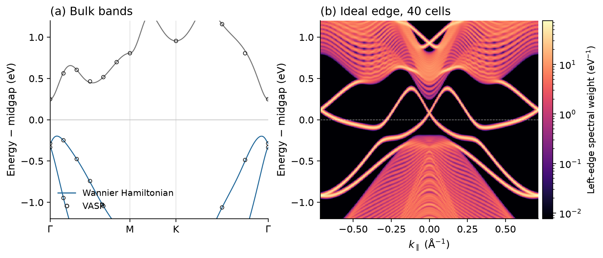
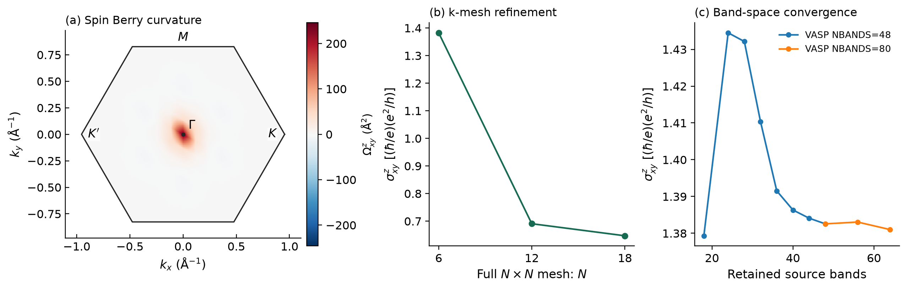
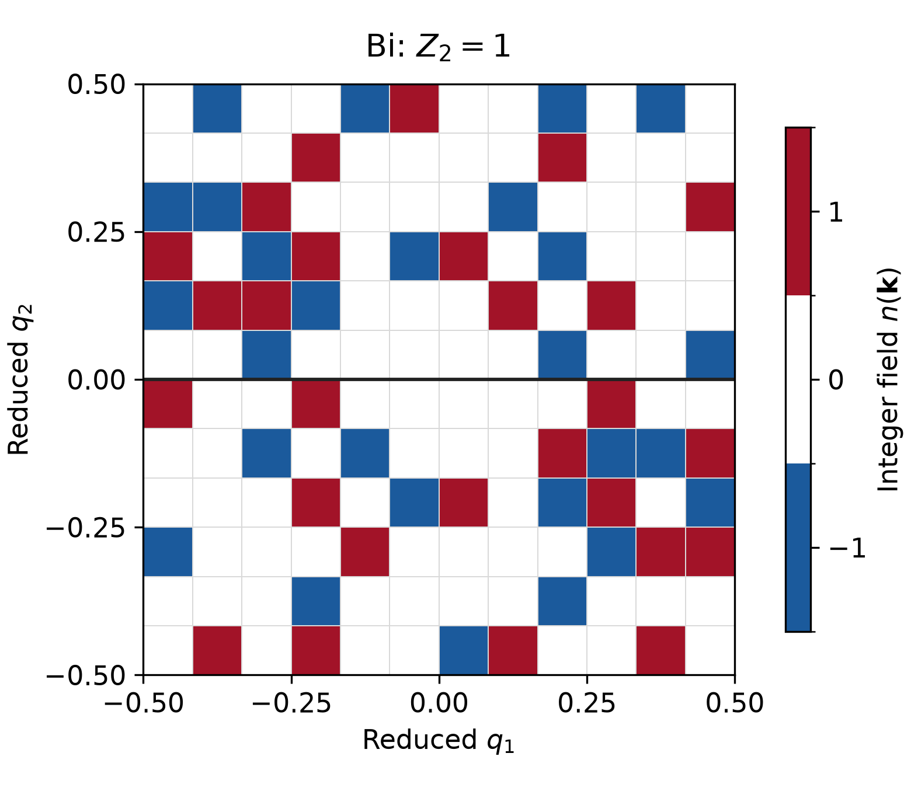

# Bi bilayer: spin Hall response and quantum spin Hall topology

This example starts from an actual two-atom buckled Bi bilayer calculated with
VASP, including spin–orbit coupling. It connects three different calculations:

1. The occupied-band Fukui–Hatsugai **Z₂ invariant** and integer n-field.
2. The **conventional intrinsic spin Hall conductivity**, using PAW spin and
   full velocity matrices from the same VASP calculation.
3. A supporting **edge-state check of Z₂ = 1**, using an ideal strip of a
   Wannier Hamiltonian fitted to these VASP states. The accompanying bulk
   dispersion is the VASP-derived Wannier interpolation of Bi's band structure.

These quantities answer different questions. Z₂ and edge connectivity diagnose
the quantum spin Hall phase. With spin–orbit coupling, the conventional spin
current need not be conserved, and its bulk conductivity need not be an integer.
This is a finite-grid response example with explicit convergence tests;
the coarse-grid conductivity is not a converged material prediction.





## What is supplied

| Input or output | Meaning |
|---|---|
| [POSCAR](inputs/POSCAR), [SCF inputs](inputs/scf/), [NSCF template](inputs/INCAR.nscf) | Actual structure and calculation settings |
| [Pseudopotential provenance](PSEUDOPOTENTIAL.md) | Matching licensed VASP PAW dataset |
| [Fresh SCF density](inputs/provenance.json) | Compressed parts restored automatically by the preparation helper |
| [Convergence-study inputs and commands](inputs/convergence/) | Actual mesh/band variants, same-k restarts and observed execution costs |
| [6×6 matrices](inputs/matrices-6x6-b48/), [12×12 matrices](inputs/matrices-12x12-b48/) | Actual complex PAW spin and full velocity matrices, all 48 source bands |
| [Wannier operators](inputs/wannier-operators/) | Actual 16-orbital Hamiltonian and position matrices |
| [Wannier source and regeneration](inputs/wannier-source/) | Actual overlaps/projections, localization sequence and licensed VASP export recipe |
| [Numerical results](reference/) | Native outputs, convergence table, band/edge energies, diagnostics and figures |
| [Reference summary](reference/summary.json) | Machine-readable settings and measured results |

The numerical matrices are derived VASP outputs, not a model substituted for
the material calculation. JSON records their units and provenance; NPZ holds
the complex matrices. A VASP source licence is needed to generate new PAW
operators. The supplied matrices allow the VASPBERRY stage to be rerun without
VASP. No POTCAR, VASP source implementation, or VASP executable is distributed.

The older [Bi Z₂ fixture](../../Bi_Z2/) remains available separately. This
example uses a fresh, documented SCF density and must not be mixed with that
archived calculation.

## 1. Recalculate from the supplied VASP matrices

Run commands from the repository root:

```bash
python3 -m pip install -r requirements-transport.txt
python3 examples/materials/bi-spin-hall/restore_matrices.py \
  --mesh 12 --output-dir results/bi/matrices12

python3 tools/vaspberry_kubo.py spin-hall \
  --matrices results/bi/matrices12/physical-matrices.npz \
  --metadata results/bi/matrices12/physical-matrices.json \
  --mesh 12 12 --occupied 10 --formats csv dat npz \
  --output-dir results/bi/hall12
```

The 12×12, 48-band reference gives
**σᶻₓᵧ = 0.6907212357 (ħ/e)(e²/h)** and charge
**σₓᵧ = 1.82×10⁻⁷ e²/h**. The full tensor, local response, chemical potential,
sampled gap, source-band count and units are in the output. `--mu-eV` may select
any chemical potential strictly inside the common gap. The current spin
workflow requires an insulating occupied bundle at zero temperature.

For the 6×6 case, restore `--mesh 6`, use `--mesh 6 6`, and choose new output
directories. It gives **1.3825549946 (ħ/e)(e²/h)**. The large difference is a
real sampling effect and demonstrates why a finite-grid result needs a mesh
study. Display interpolation does not refine the numerical integral.

To vary the retained source space, add, for example, `--source-band-limit 40`.
This recomputes both the spin-current anticommutator and the intermediate-state
sum in that smaller space. It is distinct from rerunning VASP with a larger
`NBANDS`, which also improves the upper empty eigenstates. Keep complete
degenerate groups, inspect their actual numerical splittings, and increase
both controls independently. The accurate first 64 states of an 80-band
run give a 56→64 retained-band change of about 0.15% on the 6×6 mesh.
This does not settle the larger k-sampling error. See
[convergence.csv](reference/convergence.csv) and the
[convergence reproduction procedure](inputs/convergence/README.md).

The matched mesh study uses 64 VASP bands and retains the accurate first 48:

| Full mesh | σᶻₓᵧ in (ħ/e)(e²/h) |
|---|---:|
| 6×6 | 1.3825576319 |
| 12×12 | 0.6907226657 |
| 18×18 | 0.6470204612 |

The last change is 6.75% of the 18×18 value, so **k convergence is still not
established**. All 324 points were calculated directly with VASP and integrated
without display interpolation. The 18×18 sampled global gap is 0.450991 eV.
The independent full-tensor check and source-state diagnostics are supplied
in [the reference diagnostics](reference/diagnostics/).

## 2. Generate the PAW matrices with VASP

First build the audited, opt-in [PAW producer](../../../tools/vasp544_spin_bridge/)
from an isolated, licensed VASP 5.4.4 source tree. The guide gives the supported
revision, instrumentation, build requirements and full operator definition.
The public instrumenter was tested by rebuilding from the supported original
source and reproducing the exported matrices.

Prepare four disjoint parts of the actual full mesh:

```bash
for part in 0 1 2 3; do
  python3 examples/materials/bi-spin-hall/prepare_vasp.py \
    --stage spin --potcar /path/to/matching/Bi/POTCAR \
    --mesh 12 12 --nbands 48 --chunks 4 --chunk-index "$part" \
    --output-dir "results/bi/chunk$part"
done
```

Run each prepared part with the same instrumented executable. The following
loop runs sequentially; on a suitable workstation, up to four independent
one-thread runs can be launched concurrently. Each records its own completion
and resource use.

```bash
for part in 0 1 2 3; do
  python3 tools/run_vasp_spin_producer.py \
    --run-dir "results/bi/chunk$part" \
    --binary /path/to/isolated-vasp544/bin/vasp_ncl \
    --producer-manifest /path/to/isolated-vasp544/vaspberry-spin-producer.json \
    --timeout 3600 --memory-limit-mib 4096
done

python3 tools/vaspberry_kubo.py spin-merge \
  --run-dirs results/bi/chunk0 results/bi/chunk1 \
             results/bi/chunk2 results/bi/chunk3 \
  --mesh 12 12 --occupied 10 --output-dir results/bi/assembled12
```

Run `spin-hall` from Step 1 using the two `physical-matrices` files in
`assembled12`. The preparation helper restores the supplied density and
validates the potential. To regenerate the density itself, prepare
`--stage scf`, run ordinary SOC VASP, and pass its `CHGCAR` as
`--charge /path/to/CHGCAR` to the spin stage. The structure, potential,
functional, cutoff and FFT-grid settings must match.

A single complete VASP run can instead be converted with `spin-export`:

```bash
python3 tools/vaspberry_kubo.py spin-export \
  --run-dir /path/to/completed/full-mesh-vasp --output-dir results/bi/matrices
```

The reference calculations used disjoint, uniformly weighted fixed-charge
chunks, without symmetry reconstruction. The new SCF took about 447 s and
0.88 GB peak memory on the measured workstation. The 18-point, 48-band
NSCF chunks took approximately 24 minutes and 1.27 GB each. Generating more
VASP empty states increases the cost. The nine 36-point, 64-band chunks for 18×18
took 19–46 minutes each, with a maximum observed 2.19 GB per process; the
whole queued batch took about 69 minutes on the 10-core, 64 GiB workstation.
Its VASPBERRY integration took 2.92 seconds after matrix assembly.
In comparison, VASPBERRY's 12×12 response
integration took only a few seconds; the 40-cell edge spectrum took about
three minutes. These are measured examples, not timing guarantees. The
wrapper rejects interrupted or electronically unconverged runs, and the
converter does not treat a zero exit code alone as success.

All chunks must use the same Hamiltonian and cover the mesh exactly once.
The command preserves each k point's original eigenvectors and matrix gauge;
it also assembles a full WAVECAR for the topology calculation. The supplied
producer and Python response integration run serially. Independent chunks can
run concurrently within available CPU and memory limits.

## 3. Fukui Z₂ and the n-field

The native invariant needs only an ordinary full-mesh WAVECAR. To generate
it without the optional spin/velocity producer, restore the same fresh SCF
density and prepare a complete 12×12 calculation with ordinary VASP:

```bash
python3 examples/materials/bi-spin-hall/prepare_vasp.py \
  --stage wavecar --potcar /path/to/matching/Bi/POTCAR \
  --mesh 12 12 --nbands 48 --output-dir results/bi/wavecar12

( cd results/bi/wavecar12 && /path/to/vasp_ncl > vasp.stdout.log 2> vasp.stderr.log )
```

This stage keeps the reference structure, density, SOC Hamiltonian and
electronic convergence controls, and omits optical and physical-matrix
exports. Confirm VASP reached `EDIFF` and ended normally. A different VASP
build or eigenvector gauge can change the local n-field tiles; the gap,
half-zone agreement and Z₂ parity are the relevant reproduction checks.

Then run the native executable and plot its completed field:

```bash
make serial
mkdir -p results/bi/z2
(
  cd results/bi/z2
  ../../../build/vaspberry --task z2 \
    --wavecar ../wavecar12/WAVECAR --output NFIELD \
    --mesh 12,12 --spinor 2 --bands 1:10 > vaspberry.log
)
python3 examples/features/z2/run.py \
  --plot-only results/bi/z2/Z2_FIELD.csv \
  --poscar examples/materials/bi-spin-hall/inputs/POSCAR \
  --figure results/bi/z2/figure.png
```

If the optional PAW calculation from Section 2 is already complete, replace
`../wavecar12/WAVECAR` with `../assembled12/WAVECAR` and reuse those same
states. That is the source of the distributed fresh Bi reference field;
the ordinary stage above does not require assembling physical operators.

The fresh reference gives **Z₂ = 1**, with half-zone n-field sums **−3 and +3**
(see also the [separate occupied-bundle Chern check](reference/fukui/README.md)).
The n-field is gauge dependent; its parity is the invariant. VASPBERRY's
WAVECAR topology backend uses pseudo-wavefunction overlaps, while the spin
Hall matrices include PAW augmentation. The exported Z₂ diagnostics describe
the numerical time-reversal reconstruction; the input symmetry and insulating
gap must also be checked independently.



## 4. Confirm the bulk Z₂ result with an ideal edge

The commands below interpolate the VASP-derived Bi band structure and use
the same Hamiltonian for an ideal strip. The edge connectivity provides a
boundary check of the occupied-band Z₂ calculation in Section 3.

```bash
python3 tools/vaspberry_kubo.py wannier-bands \
  --operators examples/materials/bi-spin-hall/inputs/wannier-operators \
  --vertices 0 0 0 .5 0 0 .6666666666666666 .3333333333333333 0 0 0 0 \
  --labels Gamma M K Gamma --points-per-segment 101 --formats csv npz \
  --output-dir results/bi/bands

python3 tools/vaspberry_kubo.py wannier-edge \
  --operators examples/materials/bi-spin-hall/inputs/wannier-operators \
  --width 40 --edge-cells 2 --periodic-axis 0 --open-axis 1 \
  --kpoints 201 --formats csv dat npz --output-dir results/bi/edge40
```

The Wannier model contains Bi s/p spinors, 16 orbitals per cell, and all ten
occupied bands. No occupied bands are excluded. It was fitted on the actual
6×6 mesh and checked against separate 12×12 and 18×18 VASP energies. The
sampled model gaps differ by **1.725 and 2.426 meV**, while the maximum errors
in bands 9–12 are **30.67 and 33.23 meV**. The 18×18 comparison includes
288 points outside the training grid. These are interpolation errors,
not DFT convergence errors.
The training states within the frozen window are reproduced to
4.0×10⁻¹² eV. The maximum tested model E(k)−E(−k) residual is
9.56×10⁻⁸ eV, without time-reversal averaging. The 16,000-iteration
localization stopped with a last spread change of approximately
1.6×10⁻⁸ Ų, above the requested 10⁻⁸ Ų tolerance; a fully converged
localization is not claimed. A dense 121×121 scan of the finite model gives
a sampled bulk gap of 0.447 eV, separate from the coarser direct-VASP gap
and its interpolation error.
The [source guide](inputs/wannier-source/) reproduces the localization and
effective operators from the actual VASP overlaps, and explains how to export
new overlaps from the licensed VASP calculation. This full reproduction was
run and gives the same effective Hamiltonian and position matrices.

At Γ, the separation of the central Kramers doublets decreases from
7.354 meV at 20 cells to 0.03046 meV at 40 cells. Three crossings per edge
occur in the positive half of the one-dimensional BZ at each of three
checked energies inside the bulk gap. The odd crossing count and edge
localization are checked independently in the [diagnostics](reference/diagnostics/).
Together with the bulk gap and Z₂ = 1, this odd connectivity is consistent
with time-reversal-protected topological boundary modes.

The strip is an ideal truncation of bulk hopping matrices. It describes edge
connectivity, without edge relaxation, reconstruction or self-consistent edge
electrostatics. The plotted left-edge spectral weight sums all eigenstates,
so rotations within degenerate subspaces cannot change it. Gaussian broadening
is only a display choice. Spin Hall conductivity is calculated from the PAW
matrices above, not from this 16-orbital edge Hamiltonian.

## Outputs and interpretation

CSV and DAT provide readable conductivity/curvature tables, NPZ retains the
full arrays, and JSON records conventions and diagnostics. Figures are
available as PNG, PDF and SVG. See the [output schemas](../../../docs/OUTPUT_FORMAT.md)
and [spin Hall method](../../../docs/SPIN_HALL.md).

To redraw the archived numerical results:

```bash
python3 examples/materials/bi-spin-hall/plot.py --output-dir results/bi/figures
```

The [technical report](../../../docs/TECHNICAL_REPORT.md) explains how these
calculations support the QSH interpretation and identifies the remaining
mesh, empty-state and finite-band spin-current approximation limits.
