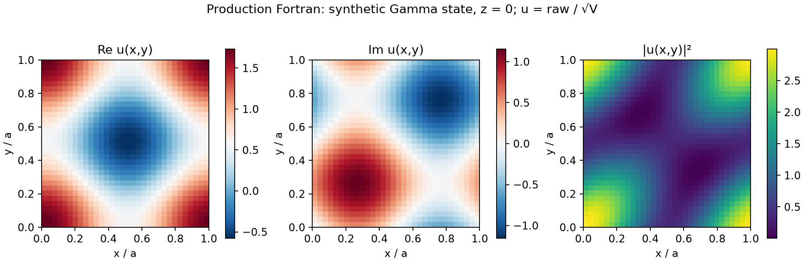

# Gamma-point wavefunction

Generate a small public synthetic WAVECAR, run production Fortran `-wf`, and check both real and imaginary amplitudes against an analytic plane-wave sum. This example needs no VASP installation or proprietary inputs.



## Run

From the repository root:

```sh
python3 -m pip install -r requirements-transport.txt
make serial
python3 validation/models/wavefunction/run.py --output-dir /tmp/vaspberry-wavefunction-example
```

The output directory must be new. An optional `--binary /path/to/vaspberry` chooses another compiled production executable. The script reads [input.json](input.json); `--input /path/to/input.json` selects a modified copy. You may set a grid with integer dimensions from 5 to 64 and `nx = ny`. Changes to the fixed scalar Gamma fixture are rejected. The script generates a 640-byte `WAVECAR.synthetic` and minimal, synthetic `POSCAR`/`EIGENVAL` header inputs, then runs this command in the output directory:

```sh
"$BINARY" -f WAVECAR.synthetic -s 1 -kx 1 -ky 1 -wf 1 -k 1 -ng 32,32,10 -im 1
```

Here `$BINARY` is the absolute path to the compiled executable. The exact command, exit code, and hashes are recorded in `result.json`; generated inputs are checked for changes after execution.

## Analytic state and amplitude convention

The cubic cell has side `a = 2π Å`, volume `V = a³`, and seven plane waves at cutoff 5 eV. For band 1, only `G = 0, +x, +y` have coefficient `1/√3`. At Gamma,

```text
u(x,y) = [1 + exp(2πi x) + exp(2πi y)] / √3
ψ(r)   = u(x,y) / √V,
```

where `x,y` are fractional coordinates. The cell average of `|u|²` is 1 and the integral of `|ψ|²` is 1. The existing Fortran wavefunction writer stores **`raw = √V u`**, in a CHGCAR-like text layout. It stores signed real/imaginary amplitudes, not a charge density. This example divides raw values by `√V` to plot `u`; to obtain normalized physical `ψ`, divide raw by `V`.

The checked 32×32×10 result has maximum complex-amplitude error `4.94e-7` in `u` and mean `|u|² = 1.0000000074`. The tolerance `2e-6` accounts for complex64 input coefficients, the legacy phase constant, and formatted output. Every grid point is checked; the compact CSV shows the `x = y, z = 0` diagonal.

## Outputs and scope

- `summary.csv`: diagonal real/imaginary amplitudes and analytic values.
- `figure.png`: actual `Re u`, `Im u`, and `|u|²` on the `z = 0` slice.
- `result.json`: pass/fail status, command, hashes, errors, grid, and normalization.
- `PARCHG-W-K001-E001-SPIN1` and `PARCHG-W-K001-E001-IM-SPIN1`: original real/imaginary production outputs, plus stdout/stderr.

The committed [reference result](reference/result.json) and [summary](reference/summary.csv) were generated by VASPBERRY 1.3.0. Compressed original grids and stdout are retained in `reference/raw/`; executable paths in the reference JSON are relative to the repository root.

This example validates a **scalar Gamma-point** state only. The single atom in the visualization header is a placeholder, not a material model; no self-consistent calculation or eigenvalue solver was used. The example does not validate non-Gamma Bloch phases, arbitrary origin shifts, spinor/SOC reconstruction, PAW augmentation, or charge-density export. Its explicit z-grid size also avoids relying on the legacy progress printer's behavior for very small grids.
