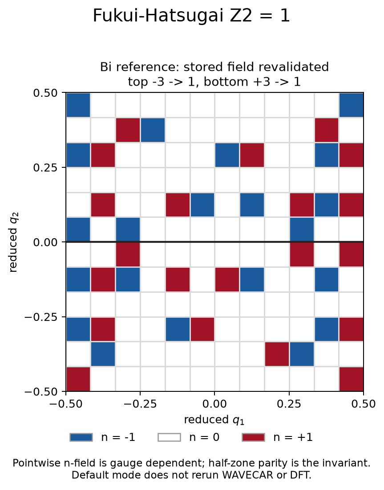

# Z2 field validation and optional Bi postprocessing

The default example **revalidates an existing public Bi result and draws a
new plot**. It does not recalculate wavefunctions, overlaps, or DFT. This
small smoke run works without a compiler, VASP, Git LFS, or the large Bi
WAVECAR. An optional second command recomputes WAVECAR postprocessing when
the actual fixture and a current executable are available.

## Default smoke command

From the repository root, with Python 3.10+:

```bash
python3 -m pip install -r requirements-transport.txt
python3 validation/models/z2/run.py --output-dir results/feature-z2
```

The directory must be new. [input.json](input.json) names and hash-binds the
existing [Bi schema-2 field](../../../examples/Bi_Z2/reference-v1.2.0-12x12/Z2_FIELD.csv);
the runner does not overwrite or relabel that historical file.

The public `examples/Bi_Z2/scripts/plot_nfield.py` reader/validator checks the
reportable schema and half-zone parity. The example additionally checks
finite rows, cell IDs, TR partner coordinates and involution, integer pair
sums, and recomputed flux/integer/link diagnostics against stored thresholds.
It regenerates the PNG using the public plotting helper.

## Checked reference

| Quantity | Result |
|---|---:|
| Mesh | 12×12, 144 plaquettes |
| Occupied subspace | bands 1–10, two-component spinors |
| Top / bottom n-field sums | -3 / +3 |
| Both half-zone parities | 1 |
| Z2 | 1 |
| Total Chern residual | approximately 1.1594×10⁻¹⁴ |
| Minimum link singular value | 0.8154547168 |
| Maximum wrapped TR-odd flux residual | approximately 1.8152×10⁻¹⁴ rad |



The checked-in [summary CSV](reference/summary.csv),
[result JSON](reference/result.json), and [PNG](reference/figure.png) were
generated by the default smoke command. The JSON explicitly records
`stored_field_validation_and_new_plot` and the original field producer
version 1.2.0. A new run produces the same three filenames.

The field was originally captured from VASPBERRY 1.2.0 commit
[`aef4d16`](https://github.com/Infant83/VASPBERRY/commit/aef4d163996d47a618b289f5251f22d26fa71981)
in [public validation run 33881876978](https://github.com/Infant83/VASPBERRY/actions/runs/33881876978).
Its exact SHA256 is recorded in `input.json`. Plot bytes may vary with
Matplotlib; integer sums and parities must agree exactly. Compare the tiny
continuous residuals with an absolute tolerance of 1e-12.

## Optional full WAVECAR postprocessing

In a checkout without LFS payloads, `examples/Bi_Z2/WAVECAR` is a small
pointer. The referenced public file is **200,421,600 bytes** with SHA256
`a8d81854f2efc561938e478dde1be29a17ccc95d5d37325c122b9d9e82fa0838`.
The runner rejects pointers and a different WAVECAR before launching a binary.

```bash
git lfs pull --include='examples/Bi_Z2/WAVECAR'
make serial
python3 validation/models/z2/run.py \
  --wavecar examples/Bi_Z2/WAVECAR \
  --binary build/vaspberry-gfortran \
  --output-dir results/feature-z2-wavecar
```

If your build uses another executable path, pass it with `--binary`; see the
[build guide](../../../docs/BUILD.md). The runner invokes the current
executable with `-z2 1 -kx 12 -ky 12 -s 2 -ii 1 -if 10` in the new result
directory, retains `fortran.log`, validates the new `Z2_FIELD.csv`, and checks
the Z2 invariant against the historical reference. The default timeout is
300 seconds and can be changed with `--timeout`. The field must report the
same software version as the checkout. Gauge-dependent pointwise n-field
values are not required to match the old file.

**The checked-in feature result is the default stored-field smoke result.**
This feature's optional WAVECAR path was not run to generate it because the
working checkout contained the LFS pointer. Successful optional execution
would still reproduce only VASPBERRY postprocessing, not the 2016 SCF/NSCF
calculation; the complete original SCF provenance is unavailable.

## Physical scope

PASS means the named numerical self-consistency checks pass. It does not
independently establish the raw input's time-reversal symmetry, Kramers
energies, occupied gap, PAW overlap completeness, or mesh convergence. The
pointwise integer n-field is gauge/log-branch dependent; the half-zone sum
modulo two is the reported invariant. Read the
[Bi provenance](../../../examples/Bi_Z2/README.md) and
[Z2 method guide](../../../docs/Z2_FUKUI_HATSUGAI.md) before applying this
method to another material.
